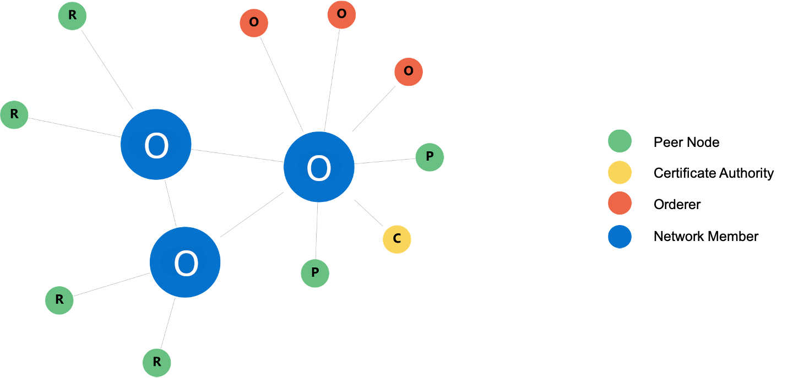
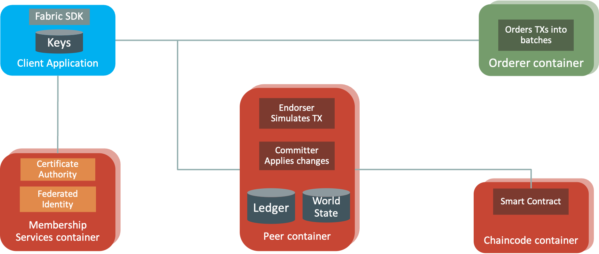
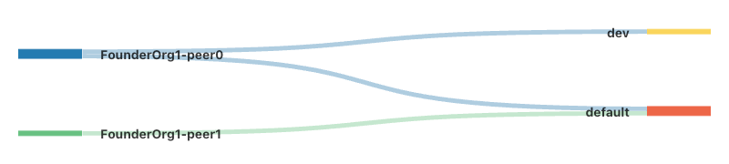
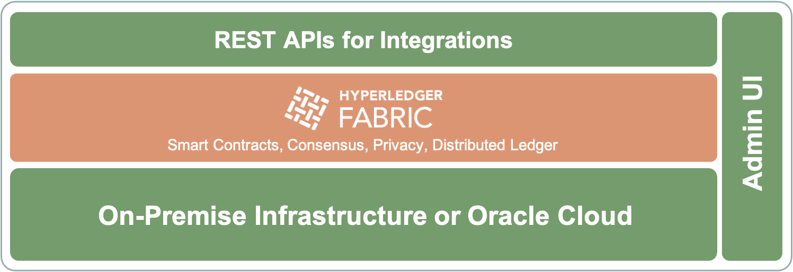
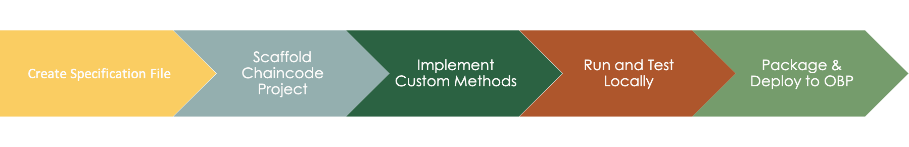
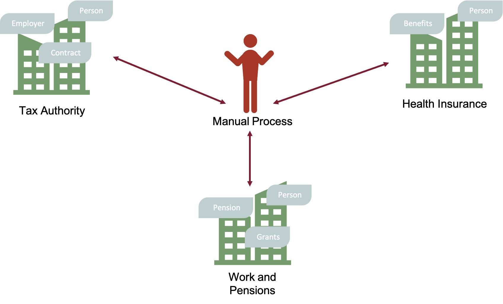
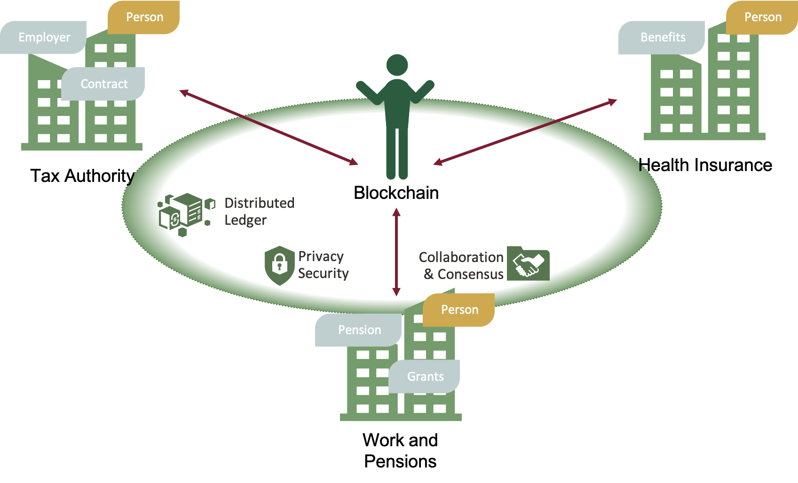
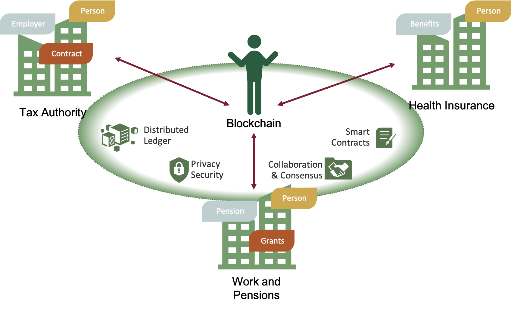
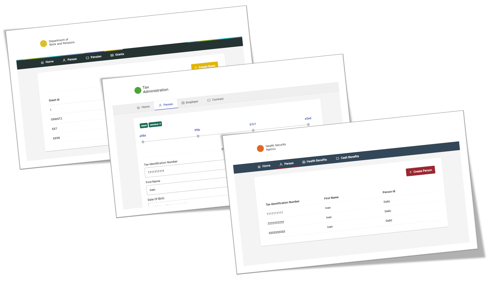

# Blockchain Introduction

- [Blockchain Introduction](#blockchain-introduction)
  - [What Is a Blockchain](#what-is-a-blockchain)
  - [What Is Hyperledger Fabric?](#what-is-hyperledger-fabric)
  - [How Oracle Enriched Hyperledger Fabric?](#how-oracle-enriched-hyperledger-fabric)
  - [What Is App Builder?](#what-is-app-builder)
  - [Why Would You Use Oracle Blockchain Platform?](#why-would-you-use-oracle-blockchain-platform)

## What Is a Blockchain
A blockchain is a system for storing data through distributed ledgers, powered by cryptography and automation. One could paraphrase it as a distributed database, but it wouldn't be fair since it's so much more. One way of looking at it might be a distributed database with a continuously growing list of irreversible records (called blocks) linked and secured using cryptography. Still, it's more than that since it contains the business logic inside (called smart contracts), enabling the automation of business processes between different organizations, in a distributed network, without any manual integrations. 

Blockchain was first introduced in 2008 as the distributed ledger behind Bitcoin and evolved in many variations. Bitcoin [manifesto](https://bitcoin.org/bitcoin.pdf) never mentioned it explicitly, but you would find many mentions of blocks and chains. The community later forged the blockchain term to describe underlying technology and techniques. Nowadays, blockchains evolved into private, public, and hybrid networks. Bitcoin and Ethereum are public permissionless blockchains, while Hyperledger Fabric implements private permissioned blockchain. A permissioned blockchain network typically has a founder that creates and maintains the network and participants that join the network. Since it's permissioned, you cannot gain access to it unless explicitly given by the founder.

## What Is Hyperledger Fabric?
Hyperledger Fabric is an enterprise-grade, permissioned blockchain framework applicable to a broad set of industry use cases. It is a widely adopted open-source tool under the Linux Foundation.

Hyperledger Fabric components create a decentralized network. The network may contain multiple organizations and nodes. Each organization has a role (network founder or member) and responsibility to manage its nodes. The below diagram presents a simple network topology where the founder organization is connected with two other member organizations in a single consortium.



The essential Hyperledger Fabric components are Peers, Orderers and Certificate Authorities. Peers hold the log of transactions (the blockchain) and the world state (aggregated view of all transactions). Orderers maintain the consistency of the state and create blocks of transactions. Certificate Authorities connect the whole network via the certificate's chain of trust by issuing keys to selected participants.



Each Peer can be in the role of Endorser and Commiter. To explain it, consider Hyperledger Fabric as a two-phase commit protocol. Take a look at the upper diagram. The Client Application proposes a typical transaction and sends it to Endorser Peer(s), which simulate the transaction. What kind of simulation? It's proper execution of all related smart contracts without writing results to the blockchain. Instead, the result of a simulated transaction is signed and returned to the Client Application. Client Application then sends a signed transaction to Orderer, which creates blocks from multiple similar transactions. Orderer then contacts Peer Node(s) by sending them transaction blocks, where the Peer Nodes now act as Committers by saving transactions in the Ledger database and updating the World State database. The final step is to notify the Client Application about the result of the process.

Other substantial Fabric components are Channels and Chaincodes. Channel is a crucial abstraction in Hyperledger Fabric, ensuring privacy and isolation among network members if needed. You can consider it a concept similar to VLAN in networking, preventing other computers on the same physical network from sensing your traffic and data. Another way of looking at it might be a VM hypervisor that enables multiple VMs on a single bare-metal computer. This is what channels essentially are - isolation and privacy of members in the same physical blockchain network. All peers belonging to a channel have access to the same data and smart contracts. There is no access to it outside the channel. The below diagram describes channels and their interaction with peers. Two distinct channels (default and dev) are isolated from each other. The default channel is executed on both peers (peer0 and peer1), while the dev channel is executed only within peer0.



Last but not least, Hyperledger Fabric components are Chaincodes. Chaincode is smart contracts, a program, written typically in Go, TypeScript, or Java that contain the business logic to be executed as transactions on the blockchain. The true power of the chaincodes is the automation of business processes in a distributed network without any manual integration or human mistakes. Want to sell your house for money and be sure you want to be tricked? Automate the process with chaincodes. 

## How Oracle Enriched Hyperledger Fabric?
Oracle embraced Hyperledger Fabric and established Oracle Blockchain Platform (OBP). Oracle Blockchain Platform is a permissioned blockchain that provides a secure ecosystem where only invited organizations can join the network and keep a copy of the ledger. The founding organization, or blockchain network owner, determines the network participants.

Oracle Blockchain Platform is a managed blockchain solution designed to set up Hyperledger Fabric network(s). It offloads the burden of Hyperledger components maintenance, focusing you on the applications and smart contract development. Oracle Blockchain Platform provides you with all the required components to support a blockchain network: computes, storage, containers, identity services, event services, and management services. Start developing and deploying blockchain applications in minutes. Build and deploy productional systems in days or weeks rather than months.



From the architectural diagram above, you can spot the added value of the Oracle Blockchain Platform in terms of REST APIs, Administrative Console, and Managed infrastructure. Rest Proxy enables fluid REST communication with Hyperledger Fabric APIs (otherwise, you need to use SDK and configure it). This significantly impacts native JavaScipt applications, removing the need to build proxy NodeJS services for accessing Hyperledger nodes. The administrative console makes the administration more manageable compared to the vanilla Hyperledger implementation. Use the user interface to manage nodes, create channels, deploy chaincodes. Managed infrastructure removes a significant maintenance burden from your back.

Writing chaincodes and operations on vanilla Hyperledger Fabric is quite a demanding job. Imagine all the nodes in containers you need to maintain on different computes in a multi-cloud environment. And what about coding? How do you test? How much time do you need to wait within each deployment on the network? For sure, it's not a trivial task. Oracle developed a toolset for rapid development to make it more manageable - Blockchain App Builder.

## What Is App Builder?
Oracle developed Oracle Blockchain App Builder as a toolset for rapid and manageable Hyperledger Fabric development that helps to develop, test, debug, and deploy smart contracts (chaincodes). It is comprised of:
* CLI
* Visual Studio Code extension
* Blockchain Development Kit

CLI makes a developer's life much more straightforward. It helps you build a fully-functional chaincode project from a specification file quickly, then run and test it on a local Hyperledger Fabric network, moving it to the production-ready Oracle Blockchain Platform network.

Visual Studio Code extension is more user-friendly usage of CLI operations. In this tutorial, I will be using the pure CLI approach.

Blockchain Development Kit is a framework that App Builder provides. Kit's process starts with designing the Specification file, which is then transformed into the scaffold chaincode project. It's a boilerplate project implemented in a preferred language. BDK supports TypeScript and Go languages. A scaffold chaincode project will save you time since it generates assets with basic CRUD operations(Hyperledeger's data entity) and chaincodes (Hyperledeger's business logic and smart contracts). Even if you don't add any custom operations, the boilerplate project will serve as a chaincode capable of executing basic chaincode operations, such as creating, reading, updating, and deleting assets. It significantly accelerates the development, making you feel like using a simple MongoDB database with all CRUD operations.



Once the scaffold chaincode project is enriched with business logic (custom methods), it can be tested locally and deployed on the production-ready Oracle Blockchain Platform from a single CLI command. All of the phases of BDK are engaged by the CLI commands.

## Why Would You Use Oracle Blockchain Platform?
Modern societies suffer from the complex bureaucracy within the citizen-to-government processes. No matter the country you are coming from, you have faced bureaucratic gaps, mismatched data, or the need to reflect your personal data in multiple distinct systems. Each country has government institutions responsible for different legal domains, such as taxes, work, health, justice, and others. Those domains are represented with the institutions such as Tax Authority, Work and Pensions Department, and Health Insurance.

The below diagram depicts citizen-to-government processes in everyday communication with Tax Authority, Work & Pensions Department, and Health insurance. Without integration between institutions, the citizen would face a lot of repetitive manual tasks of filling different papers and forms for each action you do with them.



Examining the upper diagram, you can notice that the entity ```Person``` repeats across all three institutions. It means that, most probably, all three institutions are owners of the master data. The data might be personal information such as first name, last name, address, etc. Do you want to change your data within each institution separately? Or would you prefer to follow the only-once principle? Naturally, you would like to submit it once to one institution and propagate data atomically in other institutions. The later statement follows the EU [Once Only Principle](https://ec.europa.eu/digital-building-blocks/wikis/display/CEFDIGITAL/Once+Only+Principle).

The upper example is an excellent way of achieving Blockchain Data Synchronization within dispersed networks, making the single source of truth. We will demonstrate the power of data synchronization in chapter Blockchain Data Synchronization (UC1).

For years, there has been a significant investment in integrating these kinds of systems across different countries. You remember the terms of service buses, SOA, BPEL, and others. In general, it's a good architectural pattern of integrating distributed systems. The right question might be whether it is fast to develop and cost-effective.

Still, can we do more on that topic? Can we leverage blockchain for integration and data synchronization? In the end, isn't a blockchain a distributed system suitable for data replication across multiple organizations? Yes, it is! We can design a system that will leverage distributed ledger, one of the core capabilities of blockchain, to make real-time data synchronization across multiple organizations. Hyperledger Fabric is a perfect match for it. Take a look at the diagram below. Notice the green circle uniting all three institutions, making the data synchronization for the ```Person``` entity enabled by the distributed ledger. That is a fast and cost-effective data synchronization that will allow you to change your data only once in a single institution, while all the others will have a real-time update.



What else Hypeledger Fabric brings to the government processes? The true power of the blockchain lies in the automation of smart contracts. Imagine an example where you are becoming a fresh parent. You would probably (1) suspend your working contract and (2) activate the maternity/paternity ```Grant``` to receive compensation from the government. So you are taking two actions with two different government entities. Let's assume that maternity/paternity ```Grant``` is provided by the Work and Pension Department, while the working contracts for the case of income taxation reside in Tax Authority. Activating maternity/paternity ```Grant``` implies suspension of your working contract since your employer will not pay you for the ```Grant``` duration. So it's logical to notify Tax Authority about the suspension of the working contract to get the exclusion of income tax based on salary. Again, by default, that action requires you to talk with two institutions, submitting forms and papers to both. Could we make it more simple? Can we shape better citizen UX? Is there a cost-effective method? We can achieve this process automation by using smart contracts or, more precisely, chaincodes in Hyperledger Fabric.

The picture below describes how smart contracts can automate ```Contract``` and ```Grant``` entities. Each time a citizen receives an approved maternity/paternity leave ```Grant```, all working contracts should be automatically suspended until the leave expires. In that case, you would need to visit only one institution and let the blockchain do the magic in all other institutions. It's an excellent example of frictionless government experience relying on technical enablers capable of doing so.



The upper example highlights the value of automation within dispersed networks to increase trust among members and speed of the integrated process. At the same time, it removes the uncertainty of manual integrations and human mistakes. We will demonstrate the power of automation in chapter Blockchain Data Automation (UC2).

What is the next step? Let's build a blockchain network and independent government systems.

