# Oracle Blockchain Platform as Hyperledger Fabric Environment

------
- [Oracle Blockchain Platform as Hyperledger Fabric Environment](#oracle-blockchain-platform-as-hyperledger-fabric-environment)
  - [Introduction](#introduction)
  - [Create Tax Authority (Founder Org) Instance of Oracle Blockchain Platform](#create-tax-authority-founder-org-instance-of-oracle-blockchain-platform)
  - [Create Work and Pension Department (Member Org) Instance of Oracle Blockchain](#create-work-and-pension-department-member-org-instance-of-oracle-blockchain)
  - [Connect Tax Authority (Founder Org) With Work and Pension Department (Member Org)](#connect-tax-authority-founder-org-with-work-and-pension-department-member-org)
  - [Activate Orderers Work and Pension Department (Member Org)](#activate-orderers-work-and-pension-department-member-org)
  - [Share the Channel Between Two Organizations](#share-the-channel-between-two-organizations)

## Introduction

------
Oracle Blockchain Platform is a managed blockchain solution designed to set up Hyperledger Fabric network(s). It offloads the burden of Hyperledger components maintenance, focusing you on the applications and smart contract development. Oracle Blockchain Platform provides you with all the required components to support a blockchain network: computes, storage, containers, identity services, event services, and management services.

In this article, we will build a blockchain network based on the use cases [UC1 and UC2](../01-blockchain-intro/README.md#why-would-you-use-oracle-blockchain-platform). It will perfectly highlight Hyperledger Fabric capabilities:
* Fast data synchronization in distributed environment (UC1)
* Atomic cross-organization data automation (UC2)

The guide is based on the official Oracle Blockchain Platform [documentation](https://docs.oracle.com/en/cloud/paas/blockchain-cloud/usingoci/add-obcs-participant-organizations-network.html#GUID-2AD5218E-1CD3-4FCD-BFBC-5DD404F61443). It's advisable to crosscheck this guide with official documentation for better learning process.

## Create Tax Authority (Founder Org) Instance of Oracle Blockchain Platform

------
The first step to demonstrate our use case is to create a founder organization - ```Tax Authority```.
Locate Blockchain Platform (Developer Services -> Blockchain Platform) in the OCI menu and click on it.      

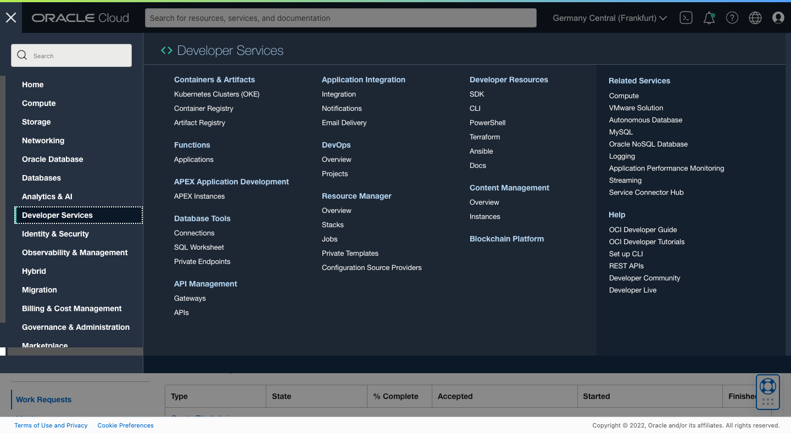

Press ```Create Blockchain Platform``` button.

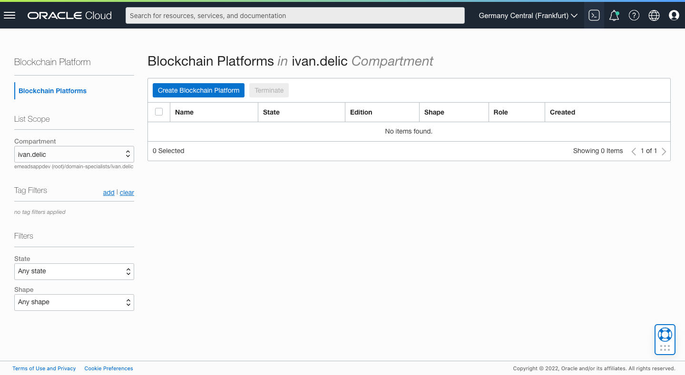

The Dialog will open to specify parameters for the founder organization. Make sure you select ```Create a new network``` since we create the founder instance. Founder instance has the privilege to control joiners into the network. Select ```Hyperledger Fabric v2.2.4```, or later if available. Since we are building a prototype, we will use ```Standard Edition```, bringing 2 OCPUs (two physical cores), 50GB of storage, and 2 peer nodes.
Additionally, it will create 3 orderer nodes and one CA node. Peer nodes are responsible for the data store of blockchain transactions and a world state. Orderer nodes seal transactions in blocks and act as consensus enablers. CA node issues certificates for network members. You would like to have more peer nodes in the production environment due to security and availability requirements.

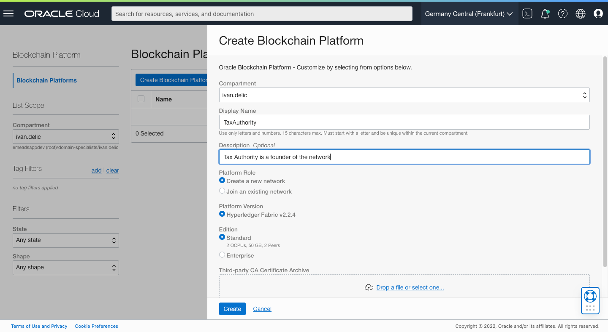

Click on the button ```Create```. Your instance is getting provisioned in status ```Creating```.

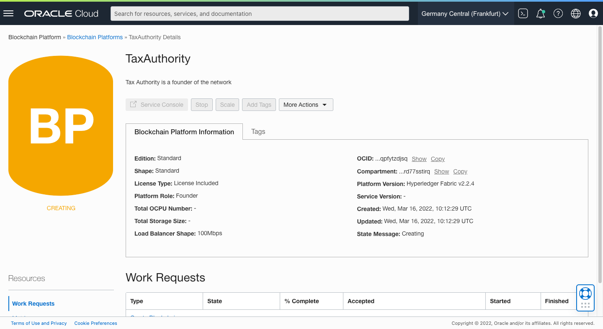

After a couple of minutes, the founder instance will be ready to play.

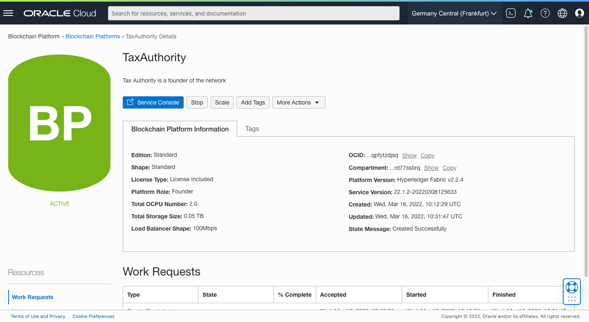

We leave the founder instance alone for a couple of minutes while we provision the member instance in the following chapter.

## Create Work and Pension Department (Member Org) Instance of Oracle Blockchain

------
The second step is to create a member organization to join the network created in the previous step - ```Work and Pension Department```.
Locate Blockchain Platform (Developer Services -> Blockchain Platform) in the OCI menu and click on it.


Press ```Create Blockchain Platform``` button.


The dialog will open to specify parameters for the member organization. Make sure you select ```Join an existing network```. Member instance network served by the founder organization. Select ```Hyperledger Fabric v2.2.4```, or later if available. We will use ```Standard Edition``` again. I will use 2 OCPUs (two physical cores), 50GB of storage, and 2 peer nodes.

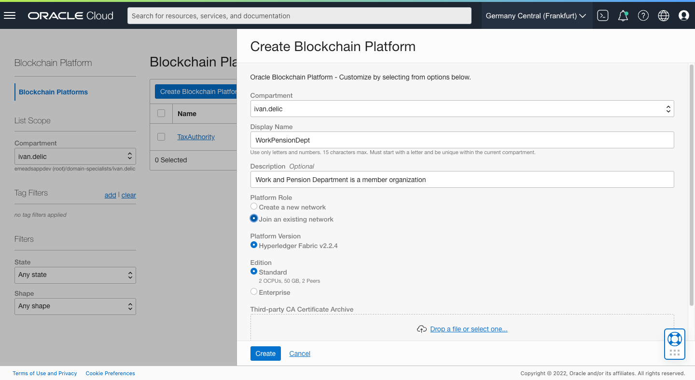

Click on the button ```Create```. Your instance is getting provisioned and soon will be available.


## Connect Tax Authority (Founder Org) With Work and Pension Department (Member Org)

------
Let's connect two freshly created organizations created. Admins of the organizations will collaborate to exchange essential information.

1. Go to ```Work and Pension Department``` (Member Org) service console.
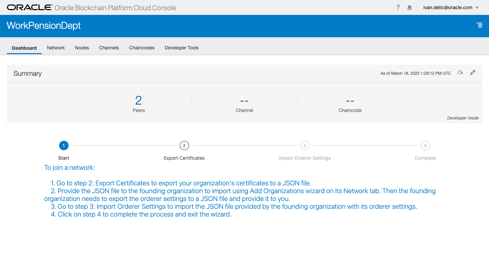
2. Go to the Step 2 and click ```Export``` button to export certificates into a JSON file.
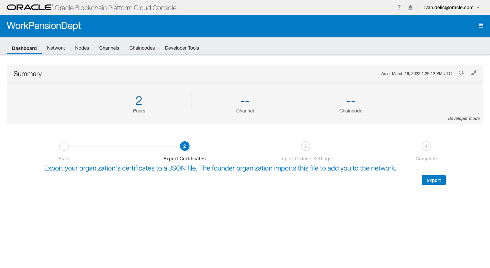
3. Login to ```Tax Authority``` (Founder Org) service console, and click on ```Add Organizations```
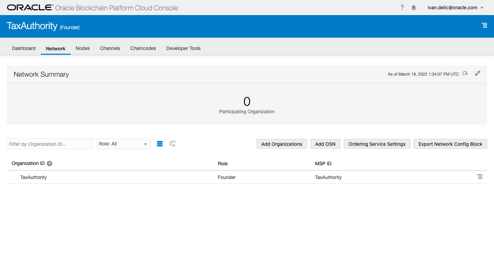
4. Select the exported json file from the 2nd step, describing ```Work and Pension Department``` organization, and press ```Add```.
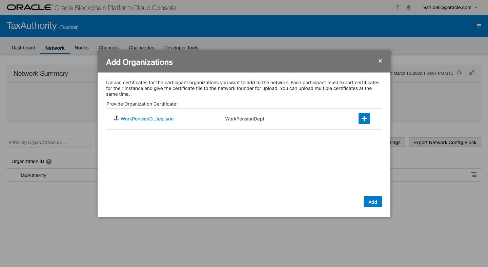
5. ```Work and Pension Department``` (Member Org) is successfully added. Click on ```Export Orderer Settings``` from the modal window, and save the JSON file.
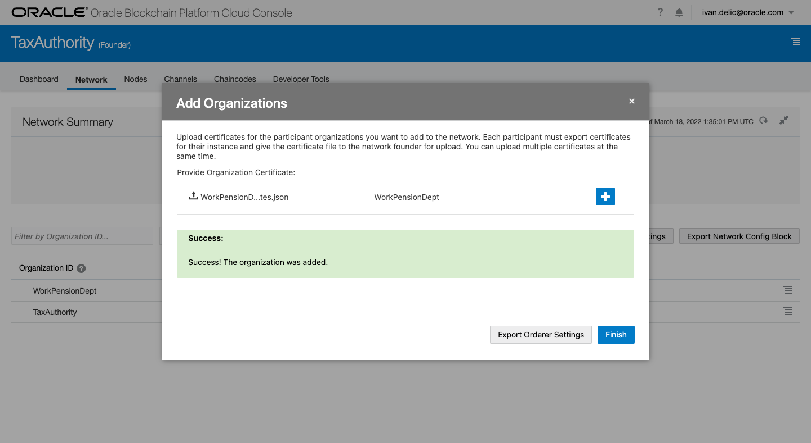
6. ```Open Work and Pension Department``` (Member Org) service console again, and select ```Step 3```. Select the JSON from the previous step, and click ```Import```. You have just imported ```Tax Authority``` (Founder Org) orderers into the  ```Work and Pension Department ``` (Member Org) organization, making it ready to sign the blocks.
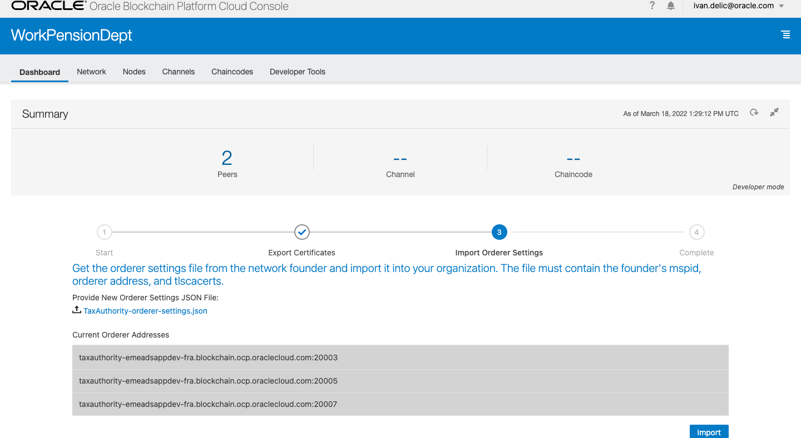
7. Click on ```Step 4``` to complete the process and exit the wizard.
8. exchange orderers

## Activate Orderers Work and Pension Department (Member Org)

------
When you provision a member instance, it is created with 3 orderers. Those orderers are inactive until they are joined to a network. We will now activate them.

1. Go to ```Work and Pension Department``` (Member Org) service console. Click on ```Nodes``` tab, and press the menu icon on the right side of ```orderer0``` node. Choose ```Export OSN Settings``` from the menu.
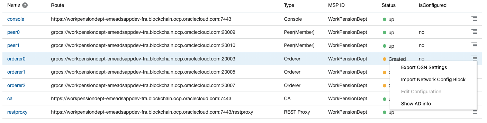
2. Go to ```Tax Authority``` (Founder Org) service console. Click on ```Network``` tab, and press  ```Add OSN``` button.
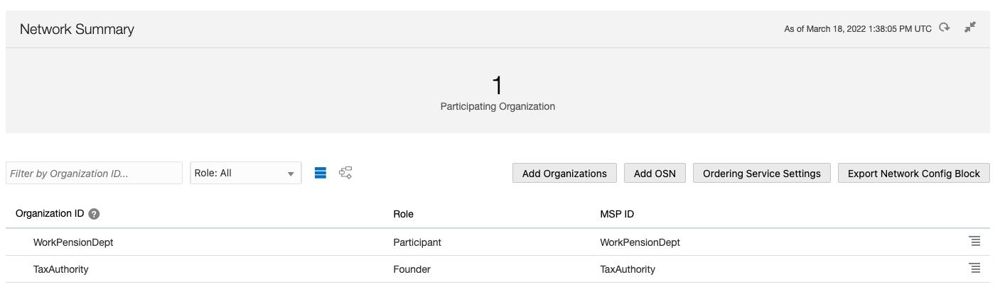
3. Upload OSN Config JSON, exported in the step 1, and press  ```Add``` button.
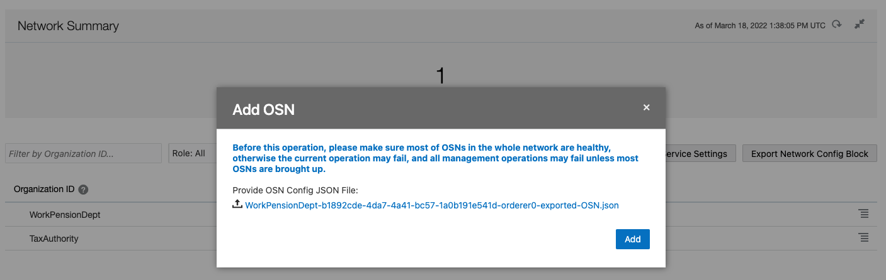
4. In the same screen, press  ```Export Network Config Block``` button.
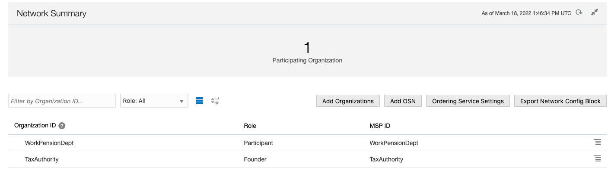
5. Go to ```Work and Pension Department``` (Member Org) service console. Click on ```Nodes``` tab, and press the menu icon on the right side of ```orderer0``` node. Choose ```Import Network Config Block``` from the menu.
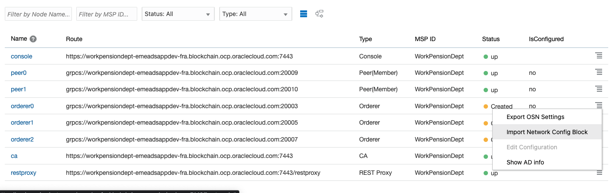
6. Select Network Config Block exported from the step 4, and press ```Import```.
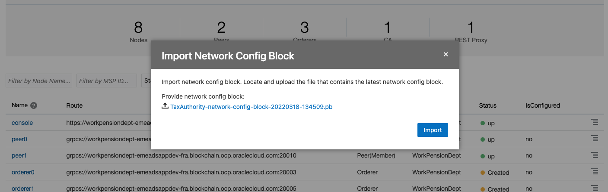
7. You will notice Orderer went to ```down``` state.
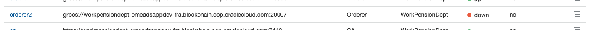
8. Press the menu icon on the right side of ```orderer0``` node. Choose ```Start``` from the menu. This will bring it back online, but this time joined to the network.  
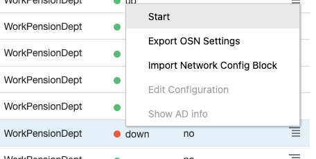
9. Repeat the same for ```orderer1``` and ```orderer2``` in sequential order. Do not try to skip steps, or do premature moves, since it will fail the process.

## Share the Channel Between Two Organizations

------
Share a channel between two freshly created organizations. I'm using the ```default``` channel created by the ```Tax Authority``` (Founder Org).

1. Go to ```Tax Authority``` (Founder Org) service console. Click on ```Channels``` tab, and select press the menu icon on the right side of ```default``` channel. Choose ```Edit Channel Organizations``` from the menu.
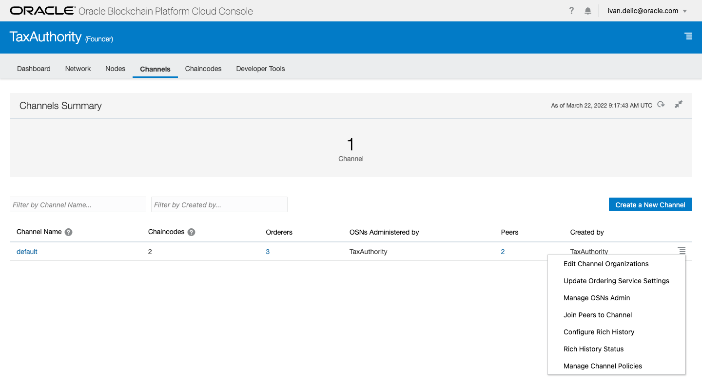
2. Select the chckbox near the ```Work and Pension Department ``` (Member Org) organization with ```ReaderWriter``` ACL and press ```Submit```. This will extend the channel to selected organization, making it available for cross-organization communication.
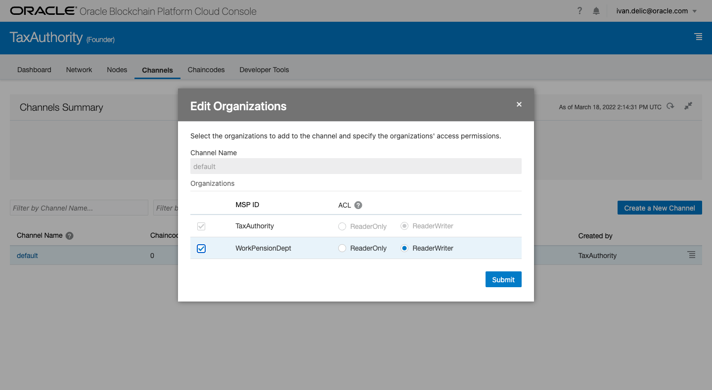
3. Click on the ```default``` channel. Choose ```Peers``` from the left menu. Mark the checkbox associated to one of the Peers (```peer0``` or ```peer1```) and press ```Set Anchor Peer``` button. It will make Anchor Peer, responsible for the cross-organization gossip communication.
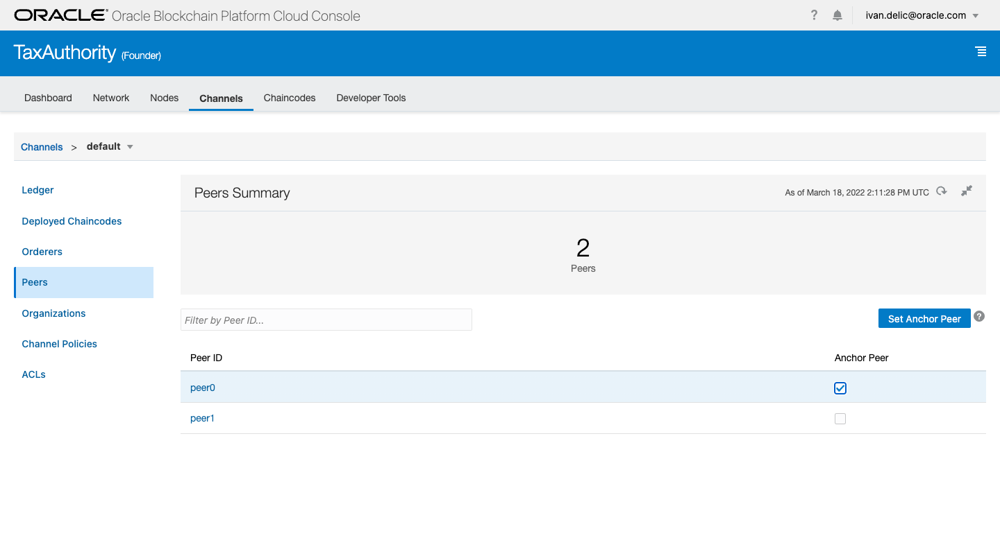
4. Login to ```Work and Pension Department``` (Member Org) service console. Click on ```Channels``` tab, and select press the menu icon on the right side of ```default``` channel. Choose ```Join Peers to Channel``` from the menu.
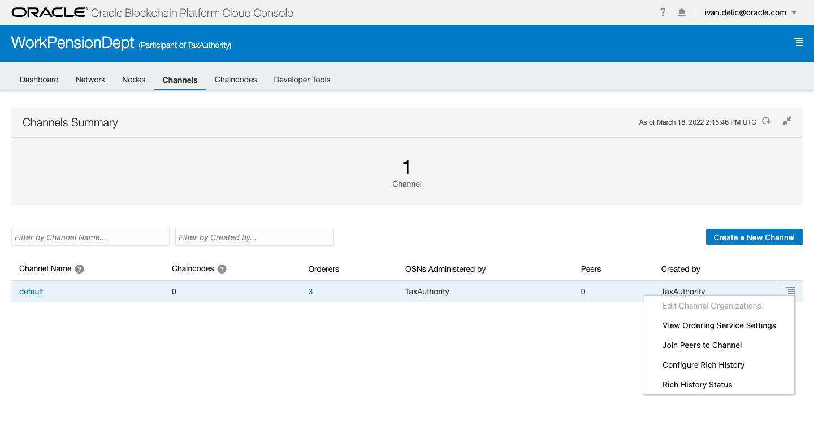
5. Select both Peers (```peer0``` or ```peer1```) and press ```Join``` button.
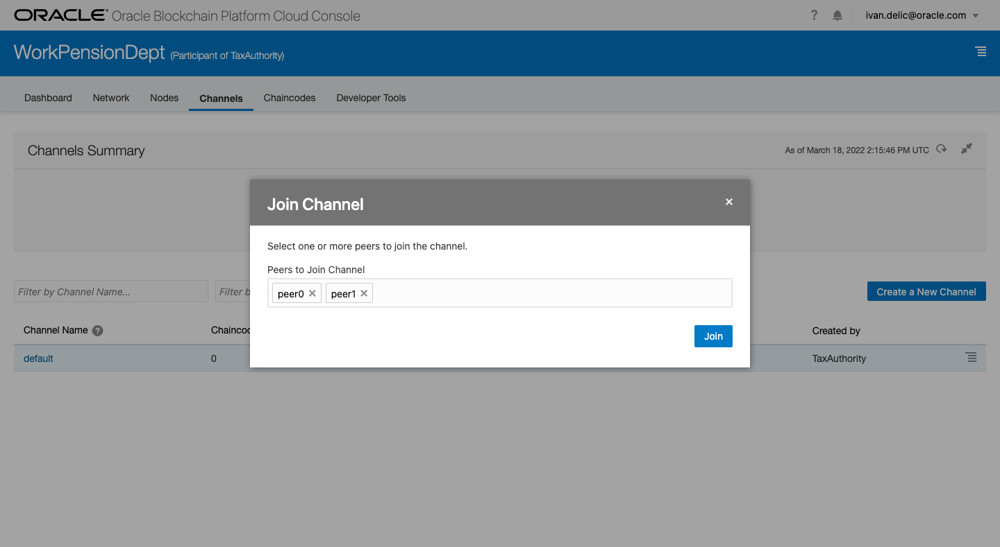
6. Click on the ```default``` channel. Choose ```Peers``` from the left menu. Mark the checkbox associated to one of the Peers (```peer0``` or ```peer1```) and press ```Set Anchor Peer``` button. Similar to step 3, it will make Anchor Peer, but this time on the ```Work and Pension Department``` organization.
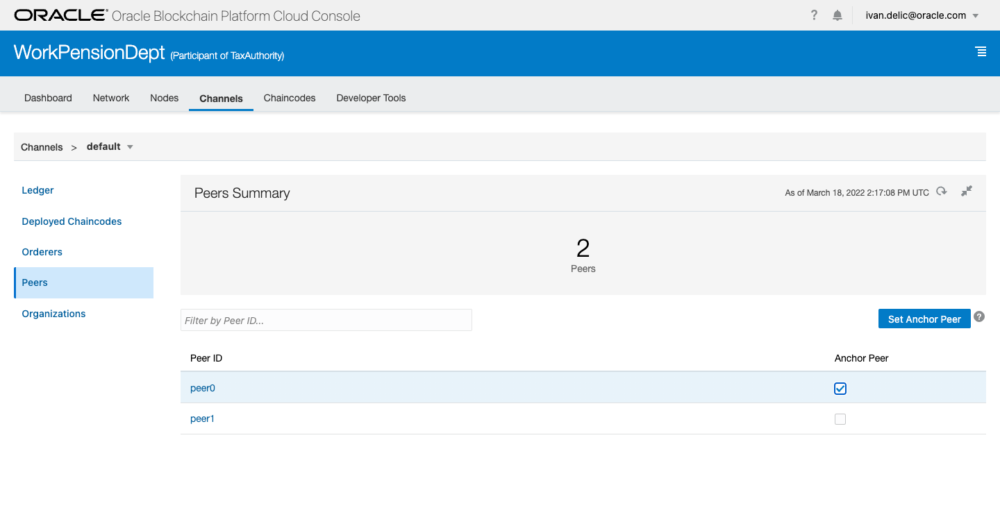

You have successfully extended the default ```channel``` across two organizations, making it capable of joined communication.