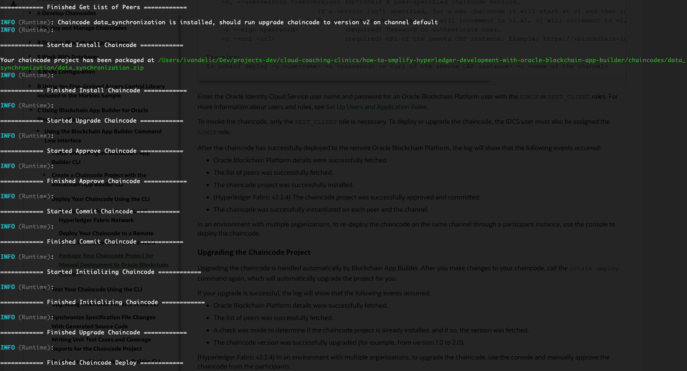
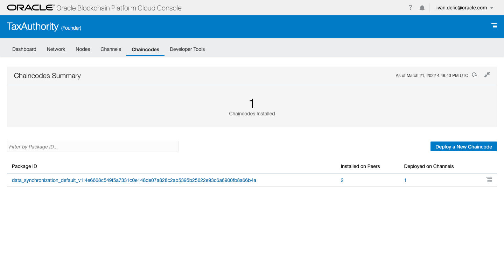
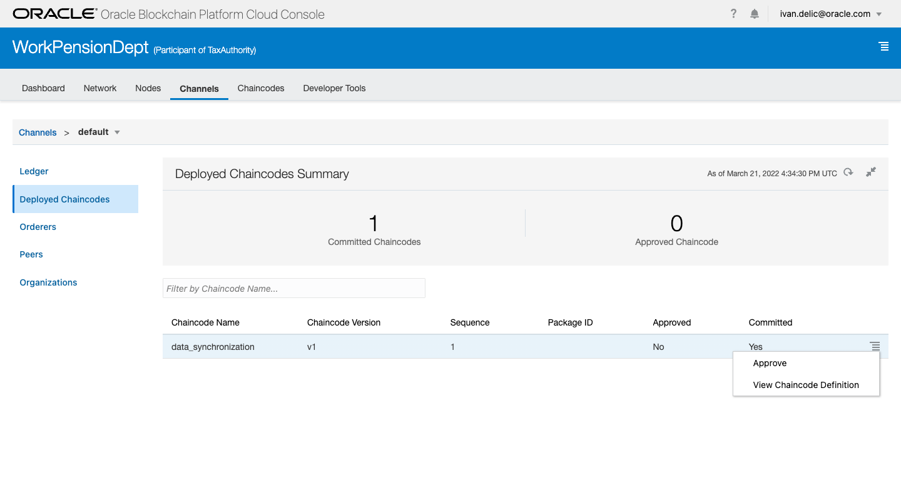
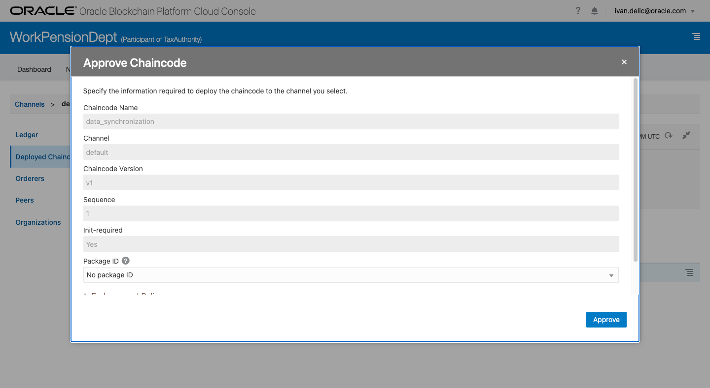
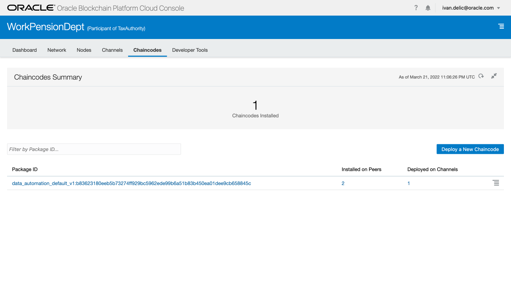
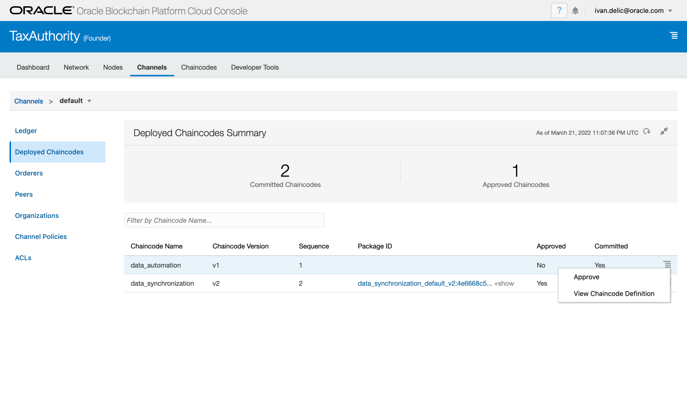
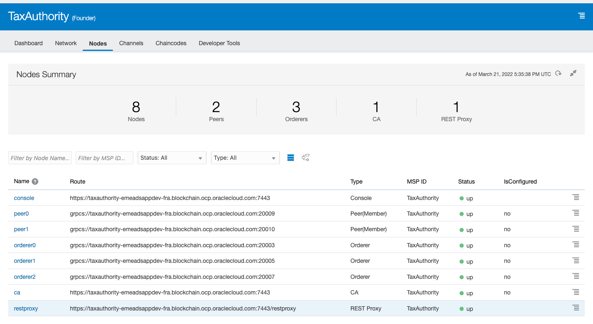
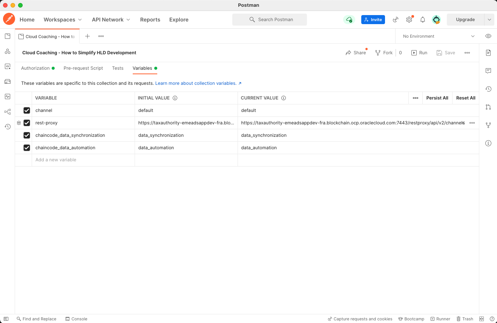
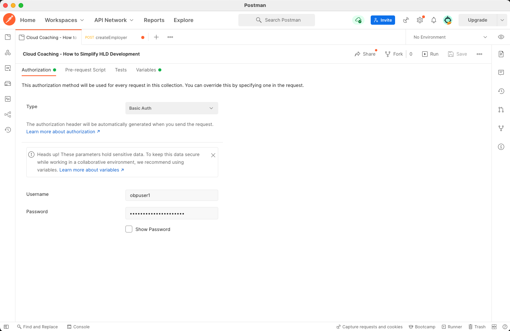
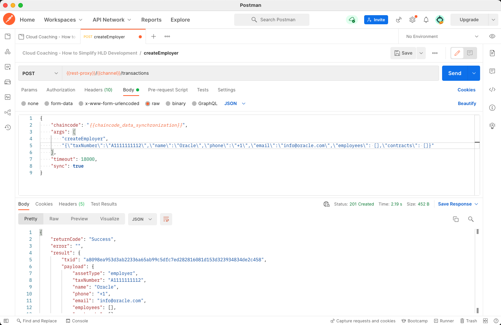

# Develop Hyperledger Fabric Applications With App Builder

---

- [Develop Hyperledger Fabric Applications With App Builder](#develop-hyperledger-fabric-applications-with-app-builder)
  - [Prerequisites](#prerequisites)
    - [Install AppBuilder CLI](#install-appbuilder-cli)
    - [Create Blockcahin User](#create-blockcahin-user)
  - [App Builder Basics](#app-builder-basics)
  - [UC1: Develop Blockchain Data Synchronization](#uc1-develop-blockchain-data-synchronization)
    - [Create Specification File](#create-specification-file)
    - [Generate Scaffolded Chaincode Project](#generate-scaffolded-chaincode-project)
    - [Implement Custom Methods](#implement-custom-methods)
    - [Run and Test Locally](#run-and-test-locally)
    - [Deploy to the Oracle Blockchain Platform](#deploy-to-the-oracle-blockchain-platform)
  - [UC2: Develop Blockchain Data Automation](#uc2-develop-blockchain-data-automation)
    - [Create Specification File](#create-specification-file-1)
    - [Generate Scaffolded Chaincode Project](#generate-scaffolded-chaincode-project-1)
    - [Implement Custom Methods](#implement-custom-methods-1)
    - [Run and Test Locally](#run-and-test-locally-1)
    - [Deploy to the Oracle Blockchain Platform](#deploy-to-the-oracle-blockchain-platform-1)
  - [Test Chaincodes With Postman](#test-chaincodes-with-postman)

Oracle developed Oracle Blockchain App Builder as a toolset for rapid and manageable Hyperledger Fabric development that helps to develop, test, debug, and deploy smart contracts (chaincodes).

## Prerequisites

---
### Install AppBuilder CLI
Installation of App Builder is dependent upon your operating system. Please follow the detailed guide from [official docs](https://docs.oracle.com/en/cloud/paas/blockchain-cloud/usingoci/install-and-configure-dev-tools-cli.html).

If the installation was successful, you can run the ```ochain``` command. Type ```ochain``` into the terminal and you will get a list of available commands:
* <code>init</code> - Initialize a new chaincode project
* <code>run</code> - Run chaincode project locally in debug mode
* <code>stop</code> - Shutdown all chaincode services locally
* <code>invoke</code> - Invoke a chaincode transaction locally
* <code>query</code> - Invoke a chaincode query locally
* <code>package</code> - Package and archive a chaincode project for manual deployment using OBP Admin UI
* <code>deploy</code> - Deploy chaincode project to remote OBP
* <code>sync</code> - Synchronize changes from spec file to the required chaincode
* <code>upgrade</code> - Upgrade chaincode project

### Create Blockcahin User
You can re-use the account you used to provision Oracle Blockchain Platform since that user is automatically added to all OBP roles. Let's call it ```<blockchain_user>```.

| :information_source: Note          |
|:-----------------------------------|
| If you build a prodution-ready network, you would likely create a dedicated user account(s) to enable CLI chaincode deployments and invocation of chaincodes through REST Proxy. Created user will need to be assigned to both ```ADMIN``` and ```REST_CLIENT``` roles. Please follow the official guide [Set Up Users and Application Roles](https://docs.oracle.com/en/cloud/paas/blockchain-cloud/administeroci/set-users-and-application-roles.html#GUID-D70C908A-9B9B-490A-8705-84E46A618B97).|

## App Builder Basics

---
The first step in chaincode development is designing the App Builder [specification file](https://docs.oracle.com/en/cloud/paas/blockchain-cloud/usingoci/input-configuration-file.html). As explained in the [introduction](../01-blockchain-intro/README.md#what-is-app-builder), a specification file is a YAML document containing assets (data entities) and their properties (entity's attributes) enriched with basic CRUD operations. Additionally, the specification file contains custom methods (smart contracts) to handle and orchestrate distributed business processes. When the specification file is ready and complete, you should run initialize to transform specification into scaffolded chaincode. Each chaincode is built by exactly one specification file. The specification file is structured in the following way:
```yaml
assets: 
    name:
    properties:
        name:
        type:
        id:
        derived:
           strategy:
           algorithm:
           format:
        mandatory:
        default:
        validate:
    methods:
        crud:
        others:
    type:
customMethods:
```

## UC1: Develop Blockchain Data Synchronization

---
### Create Specification File
We will now create the specification file ```data-synchronization-uc1.yaml``` for a chaincode responsible for data synchronization across multiple organizations, in our case ```Tax Authority``` and ```Work and Pension Department```. Please observe the business architecture from the diagram below and try to find good candidates for the first chaincode contents (assets and custom methods).


If you examine ```Tax Authority``` organization from the diagram, you will see it holds the master data records of ```Person```, ```Employer```, and ```Contract``` entities. The relationship between entities implies that each citizen (```Person```) can be employed by multiple companies (```Employer```) registered by working contracts (```Contract```). Each company has many working contracts with many citizens. When applied to the specification file, assets would look like:
```yaml
assets:
    - name: employer
    - name: person
    - name: contract
```
Each asset has different properties and attributes. For example, a ```Person``` has properties, such as tax identification number, first name, last name, date of birth, citizenship, address, etc. When enriching specification file with asset properties, you will create something similar to:
```yaml
assets:
    - name: employer
      properties:
          - name: taxNumber
            type: string
            mandatory: true
            id: true
            validate: min(11),max(11)
          - name: name
            type: string
            mandatory: true
          - name: phone
            type: string
          - name: email
            type: string
            validate: email()
          - name: address
            type: address
          - name: employees
            type: string[]
          - name: contracts
            type: string[]
      methods:
          crud: [create, getById, update, delete]
          others: [getHistoryById, getByRange]
    - name: person
      properties:
          - name: taxIdentificationNumber
            type: string
            mandatory: true
            id: true
          - name: tajNumber
            type: string
            mandatory: true
          - name: firstName
            type: string
            mandatory: true
          - name: lastName
            type: string
            mandatory: true
          - name: dateOfBirth
            type: date
          - name: citizenship
            type: string
          - name: address
            type: address
          - name: employers
            type: string[]
          - name: contracts
            type: string[]
      methods:
        crud: [create, getById, update, delete]
        others: [getHistoryById, getByRange]
    - name: contract
      properties:
        - name: contractId
          type: string
          mandatory: true
          id: true
        - name: contractDate
          type: date
          mandatory: true
        - name: personId
          type: string
          mandatory: true
        - name: employerId
          type: string
          mandatory: true
        - name: weekWorkingHours
          type: number
        - name: insuranceStart
          type: date
        - name: insuranceEnd
          type: date
        - name: suspensionStart
          type: date
        - name: suspensionEnd
          type: date
      methods:
        crud: [create, getById, update, delete]
        others: [getHistoryById, getByRange]
    - name: address
      type: embedded
      properties:
          - name: city
            type: string
            mandatory: true
          - name: postalCode
            type: string
            mandatory: true
          - name: streetName     
            type: string
            mandatory: true
          - name: houseNumber     
            type: string
            mandatory: true
          - name: building
            type: string
          - name: entrace
            type: string
          - name: floor
            type: string
          - name: door
            type: string
```
Notice the fourth asset from the snippet above - ```Address```. It's an embedded asset, reusable for both ```Employer``` and ```Person``` assets. You can consider it as the composition pattern in OOP. Also, it's essential to highlight ```methods``` block from the snippet above, enabling auto-generation of CRUD operations within the scaffold code:
```yaml
...
methods:
    crud: [create, getById, update, delete]
    others: [getHistoryById, getByRange]
...
```
When the block is attached to the asset, the generated scaffolded chaincode will implement all the basic CRUD operations without your intervention.

With that, assets are well-defined and ready for data synchronization. And yet, we still miss the business logic which connects processes between people, employers, and work contracts. We need to define smart contracts to perform business processes among multiple assets. A good example might be a smart contract which registers a ```person``` with an ```employer``` through one or more ```working contracts```:
```yaml
customMethods:
    - "createRelationship(employeeId: string, employerId: string, workingHours: number, effectiveDate: Date, contractDate: Date, contractId: string)"
```

After you detect all the necessary business processes over the assets in the chaincode, you create a list of custom methods. We will implement those methods afterward when the scaffolded project is generated. Let's add all the required smart contracts in the ```customMethods``` block:
```yaml
customMethods:
    - "createRelationship(employeeId: string, employerId: string, workingHours: number, effectiveDate: Date, contractDate: Date, contractId: string)"
    - "updateRelationship(contractId: string, workingHours: number, effectiveDate: Date)"
    - "terminateRelationship(contractId: string, effectiveDate: Date)"
    - "suspendRelationshipStart(contractId: string, suspensionStartDate: Date)"
    - "suspendRelationshipEnd(contractId: string, suspensionEndDate: Date)"
    - "suspendAllRelationshipStart(employeeId: string, suspensionStartDate: number)"
    - "suspendAllRelationshipEnd(employeeId: string, suspensionEndDate: number)"
    - executeQuery
```

| :information_source: Note          |
|:-----------------------------------|
| ```executeQuery``` method enables you to execute SQL-ish queries on top of the world state database! Count, group, filter assets and more. Detailed instructions can be found [here](https://docs.oracle.com/en/database/other-databases/blockchain-enterprise/21.1/user/supported-rich-query-syntax.html#GUID-7A7766A3-EA2C-4A3D-BE62-7B4EC747EE5B).|

The complete specification file is available [data-synchronization-uc1.yaml](specification/data-synchronization-uc1.yaml):

### Generate Scaffolded Chaincode Project
Position yourself in the root of ```03-develop-app``` directory. We will run the ```ochain init``` command to generate a scaffolded chaincode project.
```console
ochain init --cc data_synchronization --lang ts --conf specification/data-synchronization-uc1.yaml -o chaincodes
```
```--cc data_synchronization``` is specifies the chaincode name, while ```--lang ts``` instructs App Builder to generate TypeScript based chaincode. ```--conf specification/data-synchronization-uc1.yaml``` selects input specification file with predefined assets and custom methods. ```-o chaincodes``` targets a directory where the scaffolded chaincode project will be generated.

After a while, you will get a confirmation of successful generation of the scaffolded project:
```console
added 1031 packages from 493 contributors in 91.193s
40 packages are looking for funding
  run `npm fund` for details
Building data_synchronization...
Your chaincode project is ready: data_synchronization
```
### Implement Custom Methods

Open the generated project from location ```03-develop-app/chaincodes/data_synchronization```, locate the file ```src/data_synchronization.controller.ts``` and implement the custom methods at the bottom of the file. You need to implement the following methods: ```createRelationship```, ```updateRelationship```, ```terminateRelationship```, ```suspendRelationshipStart```, ```suspendRelationshipEnd```, ```suspendAllRelationshipStart```, ```suspendAllRelationshipEnd```, and ```executeQuery```. I will use the implementation in the template file [data_synchronization.controller.template](chaincodes/custom-methods/data_synchronization.controller.template).

Don't forget to import the Shim (```import { Shim } from 'fabric-shim';```) on top of the ```data_synchronization.controller.ts```, since we use it in one of the implemented methods.

### Run and Test Locally
Position yourself in the working directory. We will run the ochain run command to run the chaincode project locally.
```console
ochain run -p chaincodes/data_synchronization
```

### Deploy to the Oracle Blockchain Platform
Position yourself in the root of ```03-develop-app``` directory. Run the ```ochain deploy``` command to deploy the chaincode on the remote OBP.
```console
ochain deploy -u <blockchain_user> -s <blockchain_pass> -r <blockchain_url> -c default -P chaincodes/data_synchronization
```
* ```<blockchain_user>``` is the user defined in the [introduction](#create-blockcahin-user)
* ```<blockchain_pass>``` is the user password
* ```<blockchain_url>``` is the service console URL of the ```Tax Authority``` organization. In my case it is ```https://taxauthority-emeadsappdev-fra.blockchain.ocp.oraclecloud.com:7443/```.

Upon the successful execution, you will see something similar to:



When you open ```Tax Authority``` service console and select the ```Chaincodes``` tab, you will see the fresh chaincode you have just installed, deployed on the targeted channel (in my case ```default```).



Now open the ```Work and Pension Department``` service console and select ```Channels``` tab ->  ```Deployed Chaincodes```. You will see a list of pending, unapproved chaincodes. The chaincode is ready for installation on peers owned by the ```Work and Pension Department```. Even we never installed chaincodes in the ```Work and Pension Department``` organization manually, they have still arrived at it by gossip protocols. Since both organizations are a part of the same network, chaincode binaries were transferred to the ```Work and Pension Department``` peers, waiting for approval and activation. Gossip protocol saves significant time and effort of installing chaincodes on all member organizations. Remember, a typical blockchain network can have many participant members.



Press ```Approve``` to install it on the ```Work and Pension Department``` to enable inter-organization communication between organizations.



Both organizations have the same chaincodes to operate. We did all the prerequisites for successful data manipulation in our network.

## UC2: Develop Blockchain Data Automation

---
It's time to develop the second chaincode for data automation, playing the significant role as smart contracts across the blockchain. The true power of the blockchain lies in the automation of smart contracts. Imagine an example where you are becoming a fresh parent. You would probably (1) suspend your working contract and (2) activate the maternity/paternity leave to receive compensation from the government. The process is fully manual, since you contact two distinct organizations. Let's create an automation that would enable you to visit only one institution and let the blockchain do the magic in all other institutions.

### Create Specification File
We will now create the specification file ```data-automation-uc2.yaml``` for a chaincode responsible for data automation across multiple organizations, in our case ```Tax Authority``` and ```Work and Pension Department```. Please observe the business architecture from the diagram below and try to find good candidates for the second chaincode contents (assets and custom methods).


If you examine ```Work and Pension Department``` organization from the diagram, you will see it holds the master data records of ```Person```, ```Leave```, and ```Pension``` entities. The relationship between entities implies that each citizen (```Person```) can have a regitered ```Pension``` or a paid ```Leave```. We already covered ```Person``` entity withtin the first chaincode. When applied to the specification file, assets would look like:
```yaml
assets:
    - name: leave
    - name: pension
```
The complete specification file might be as [data-automation-uc2.yaml](specification/data-automation-uc2.yaml):
```yaml
assets:
    - name: leave
      properties:
        - name: leaveId
          type: string
          mandatory: true
          id: true
        - name: leaveDate
          type: date
          mandatory: true
        - name: personId
          type: string
          mandatory: true
        - name: employerId
          type: string
          mandatory: true
        - name: leaveStart
          type: date
        - name: leaveEnd
          type: date
      methods:
        crud: [create, getById, update, delete]
        others: [getHistoryById, getByRange]
    - name: pension
      properties:
        - name: pensionId
          type: string
          mandatory: true
          id: true
        - name: personId
          type: string
          mandatory: true
        - name: pensionStart
          type: date
        - name: pensionEnd
          type: date
      methods:
        crud: [create, getById, update, delete]
        others: [getHistoryById, getByRange]
customMethods:
    - "startLeave(personId: string, employerId: string, effectiveDate: Date, contractId: string)"
    - "endLeave(personId: string, employerId: string, effectiveDate: Date, contractId: string)"
    - executeQuery
```

### Generate Scaffolded Chaincode Project
Position yourself in the root of ```03-develop-app``` directory. We will run the ```ochain init``` command to generate a scaffolded chaincode project.
```console
ochain init --cc data_automation --lang ts --conf specification/data-automation-uc2.yaml -o chaincodes
```
```--cc data_automation``` is specifies the chaincode name, while ```--lang ts``` instructs App Builder to generate TypeScript based chaincode. ```--conf specification/data-automation-uc2.yaml``` selects input specification file with predefined assets and custom methods. ```-o chaincodes``` targets a directory where the scaffolded chaincode project will be generated.

After a while, you will get a confirmation of successful generation of the scaffolded project.
### Implement Custom Methods

Open the generated project from location ```03-develop-app/chaincodes/data_automation```, locate the file ```src/data_automation.controller.ts``` and implement the custom methods at the bottom of the file. You need to implement the following methods: ```startLeave```, ```endLeave```, and ```executeQuery```. I will use the implementation in the template file [data_automation.controller.template](chaincodes/custom-methods/data_automation.controller.template).

### Run and Test Locally
Position yourself in the working directory. We will run the ochain run command to run the chaincode project locally.
```console
ochain run -p chaincodes/data_automation
```

### Deploy to the Oracle Blockchain Platform
Position yourself in the root of ```03-develop-app``` directory. Run the ```ochain deploy``` command to deploy the chaincode on the remote OBP.
```console
ochain deploy -u <blockchain_user> -s <blockchain_pass> -r <blockchain_url> -c default -P chaincodes/data_automation
```
* ```<blockchain_user>``` is the user defined in the [introduction](#create-blockcahin-user)
* ```<blockchain_pass>``` is the user password
* ```<blockchain_url>``` is the service console URL of the ```Work and Pension Department``` organization. In my case it is ```https://workpensiondept-emeadsappdev-fra.blockchain.ocp.oraclecloud.com:7443/```.

Upon the successful execution, you will screen similar console output as in the picture below.


When you open ```Work and Pension Department``` service console and select the ```Chaincodes``` tab, you will see the fresh chaincode you have just installed, deployed on the targeted channel (in my case ```default```).



Now open the ```Tax Authority``` service console and select ```Channels``` tab ->  ```Deployed Chaincodes```. You will see a list of pending, unapproved chaincodes. The chaincode is ready for installation on peers owned by the ```Tax Authority```. Even we never installed chaincodes in the ```Tax Authority``` organization manually, they have still arrived at it by gossip protocols. Since both organizations are a part of the same network, chaincode binaries were transferred to the ```Tax Authority``` peers, waiting for approval and activation. Gossip protocol saves significant time and effort of installing chaincodes on all member organizations. Remember, a typical blockchain network can have many participant members.


Press ```Approve``` to install it on the ```Tax Authority``` to enable inter-organization communication between organizations.



Both organizations have the same chaincodes version of data automation chaincode.

## Test Chaincodes With Postman

---
Find the ```restproxy``` URL in the ```Tax Authority``` service console by selecting ```Nodes``` tab. Copy the URL, as in the picture below.

 

Paste the URL in Postman collection imported from [postman.json](chaincodes/postman/postman.json) into the variable ```rest-proxy```, under the ```CURRENT VALUE```:



Enter the correct ```<blockchain_user>``` and ```<blockchain_pass>``` with assigned REST_CLIENT role.



Invoke the chaincode ```createEmployer```. When you receive response ```"returnCode": "Success"```, you have sucessfuly created new asset on the blockchain.



That completes the chaincode development chapter. THe next step is to build UI for the ```Tax Authority``` and ```Work and Pension Department``` organizations.