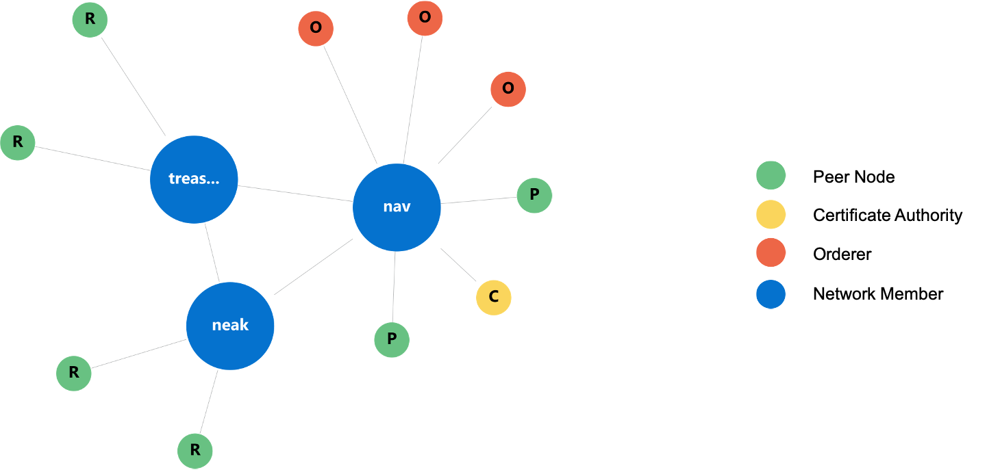
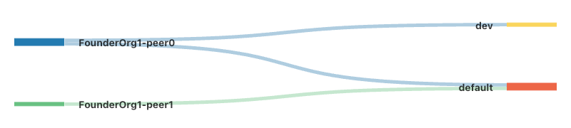
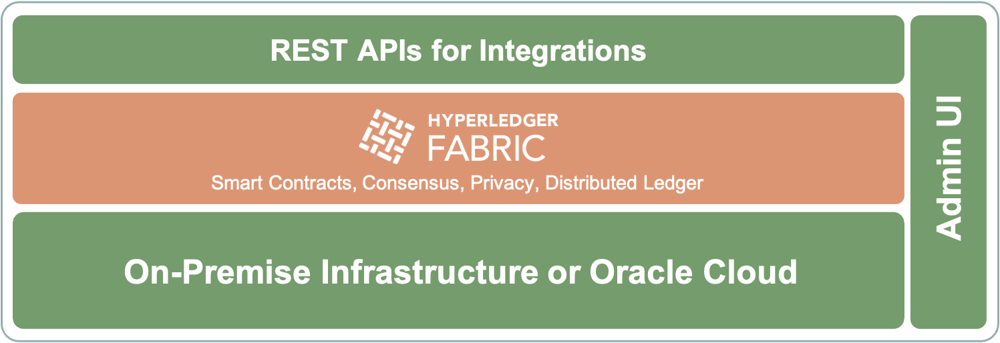
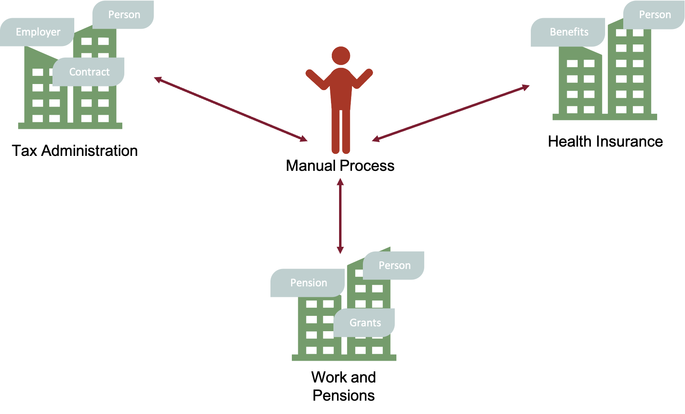
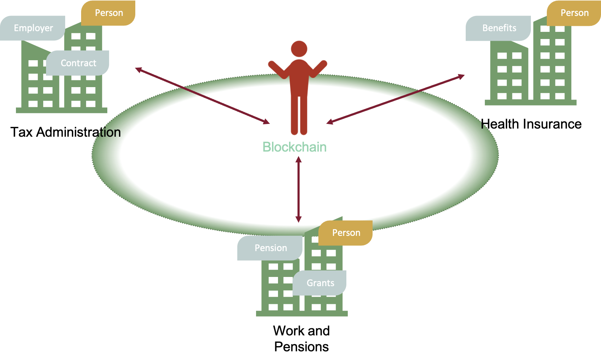
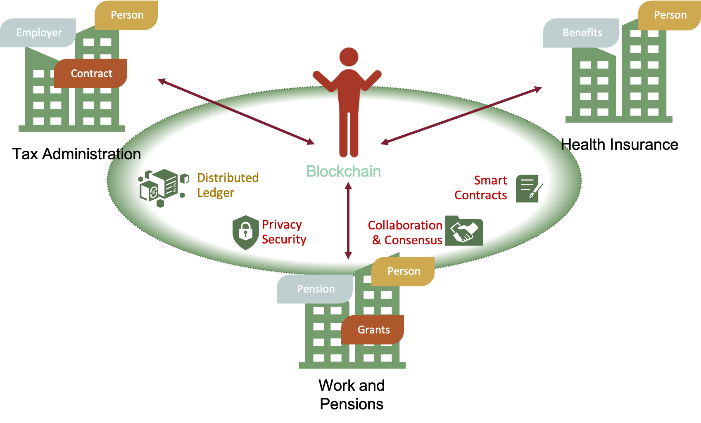
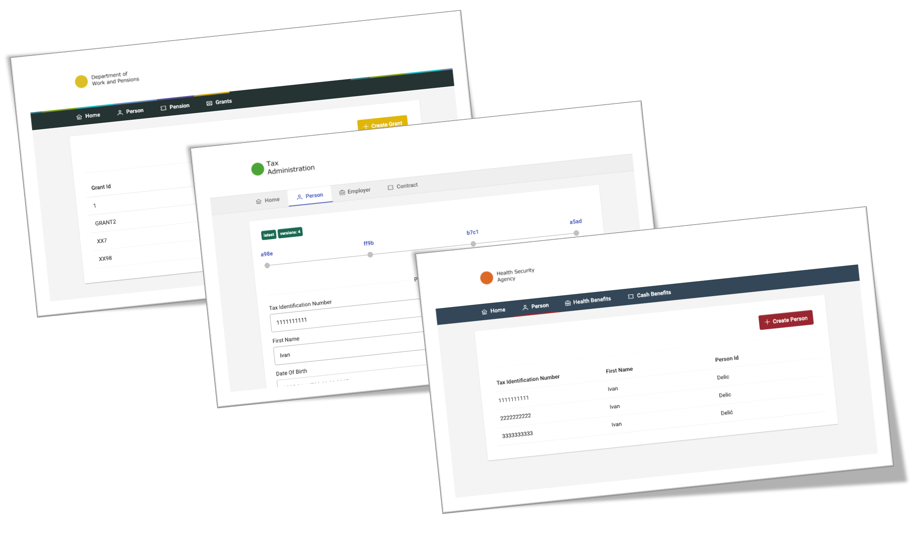
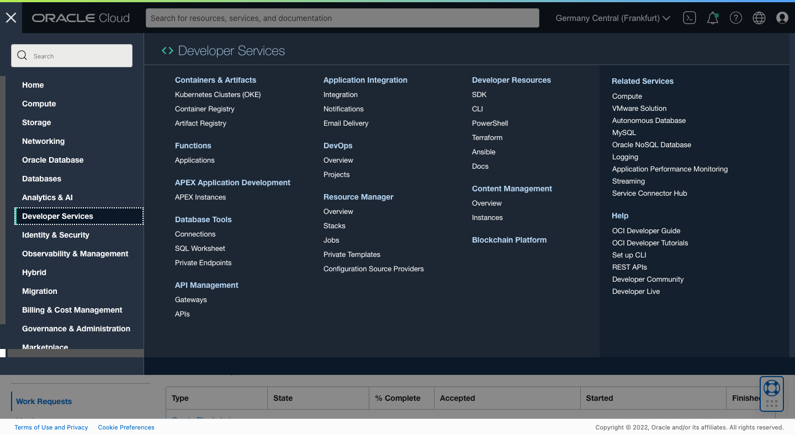
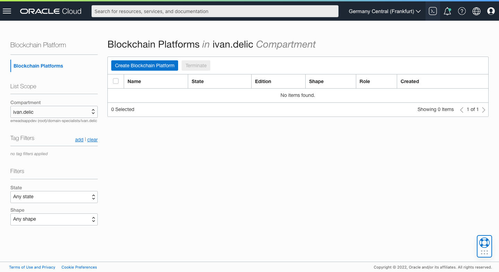
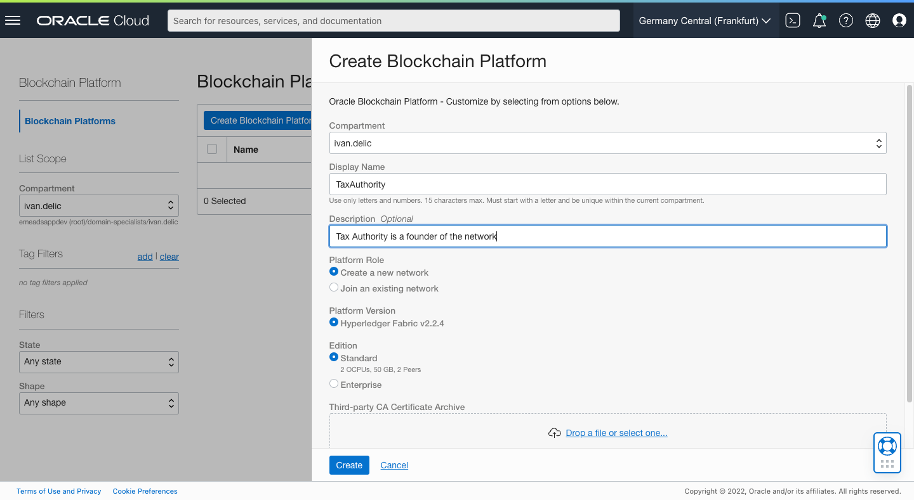

# How to simplify Hyperledger development with Oracle Blockchain App Builder
What is a Blockchain? What can Oracle Blockchain offer beyond Hyperledger Fabric? How to build a production-grade blockchain network with smart contracts and test them locally? Why should you leverage DLT and smart contracts in every typical architecture? Continue reading and explore highlights of Oracle Blockchain Platform, together with a new toolset for building smart contracts - Blockchain App Builder.

## Introduction

### A Blockchain
A blockchain is a system for storing data through distributed ledgers, powered by cryptography and automation. I could paraphrase it as a distributed database, but it wouldn't be fair since it's so much more. One way of looking at it might be a distributed database with a continuously growing list of irreversible records (called blocks) linked and secured using cryptography. Still, it's more than that since it contains the business logic inside (called smart contracts), enabling the automation of business processes between different organizations, in a distributed network, without any manual integrations. 

Blockchain was first introduced in 2008 as the distributed ledger behind Bitcoin and evolved in many variations. Nowadays, blockchains evolved into private, public, and hybrid networks. Bitcoin and Ethereum are public permissionless blockchains, while Hyperledger Fabric implements private permissioned blockchain. A permissioned blockchain network typically has a founder that creates and maintains the network and participants that join the network. Since it's permissioned, you cannot gain access to it unless explicitly given by the founder.

### What is Hyperledger Fabric?
Hyperledger Fabric is an enterprise-grade, permissioned blockchain framework applicable to a broad set of industry use cases. It is a widely adopted open-source tool under the Linux Foundation.

Hyperledger Fabric components create a decentralized network. The network may contain multiple organizations and nodes. Each organization has a role (network founder or member) and responsibility to manage its nodes. The below diagram presents a simple network topology where the founder organization is connected with two other member organizations in a single consortium.

The essential Hyperledger Fabric components are Peers, Orderers and Certificate Authorities. Peers hold the log of transactions (the blockchain) and the world state (aggregated view of all transactions). Orderers maintain the consistency of the state and create blocks of transactions. Certificate Authorities connect the whole network via the certificate's chain of trust by issuing keys to selected participants.

Other substantial Fabric components are Channels and Chaincodes. Channel is a crucial abstraction in Hyperledger Fabric, ensuring privacy and isolation among network members if needed. You can consider it a concept similar to VLAN in networking, preventing other computers on the same physical network from sensing your traffic and data. Another way of looking at it might be a VM hypervisor that enables multiple VMs on a single bare-metal computer. This is what channels essentially are - isolation and privacy of members in the same physical blockchain network. All peers belonging to a channel have access to the same data and smart contracts. There is no access to it outside the channel. The below diagram describes channels and their interaction with peers. Two distinct channels (default and dev) are isolated from each other. The default channel is executed on both peers (peer0 and peer1), while the dev channel is executed only within peer0.

Last but not least, Hyperledger Fabric components are Chaincodes. Chaincode is smart contracts, a program, written typically in Go, TypeScript, or Java that contain the business logic to be executed as transactions on the blockchain. The true power of the chaincodes is the automation of business processes in a distributed network without any manual integration or human mistakes. Want to sell your house for money and be sure you want to be tricked? Automate the process with chaincodes. 

### How Oracle Enriched Hyperledger Fabric?
Oracle embraced Hyperledger Fabric and established Oracle Blockchain Platform (OBP). Oracle Blockchain Platform is a permissioned blockchain that provides a secure ecosystem where only invited organizations can join the network and keep a copy of the ledger. The founding organization, or blockchain network owner, determines the network participants.

Oracle Blockchain Platform is a managed blockchain solution designed to set up Hyperledger Fabric network(s). It offloads the burden of Hyperledger components maintenance, focusing you on the applications and smart contract development. Oracle Blockchain Platform provides you with all the required components to support a blockchain network: computes, storage, containers, identity services, event services, and management services. Start developing and deploying blockchain applications in minutes. Build and deploy productional systems in days or weeks rather than months.

From the architectural diagram above, you can spot the added value of the Oracle Blockchain Platform in terms of REST APIs, Administrative Console, and Managed infrastructure. Rest Proxy enables fluid REST communication with Hyperledger Fabric APIs (otherwise, you need to use SDK and configure it). This significantly impacts native JavaScipt applications, removing the need to build proxy NodeJS services for accessing Hyperledger nodes. The administrative console makes the administration more manageable compared to the vanilla Hyperledger implementation. Use the user interface to manage nodes, create channels, deploy chaincodes. Managed infrastructure removes a significant maintenance burden from your back.

To make Hyperledger Fabric development more manageable, Oracle developed a toolset for rapid blockchain development - Blockchain App Builder. It comprises CLI and Visual Studio Code extensions that help develop, test, debug, and deploy smart contracts (chaincodes) on Oracle Blockchain networks.

### Why Would You Use Oracle Blockchain Platform?

## Hands-On

### Create Tax Authority (Founder Org) instance of Oracle Blockchain
In the OCI menu, locate Blockhain Platform (Developer Services -> Blockchain Platform) and click on it.      

Press Create Blockchain Platform button. This will open a dialog to specify parameters fo the founder organization.

Make sure you select "Create a new network", since we are creating founder instance. Founder instance has the priviledge to control late joiners into the network. Sine we are doing just a prototype, we will use Standard edition, bringing 2 OCPUs (two physical cores), 50GB of storage and 2 peer nodes. Remember, peer nodes are the nodes responsible for preservance of the data in blockchain. In ideal production world, you would like to have more peer nodes due to security and availabiltiy requirements.

### Create Work and Pension Department (Member Org) instance of Oracle Blockchain