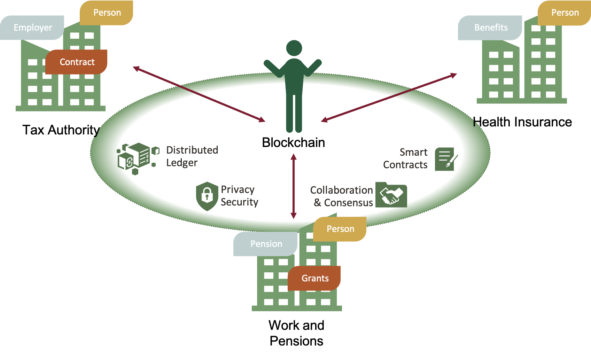

# How to simplify Hyperledger development with Oracle Blockchain App Builder
What is a Blockchain? What can Oracle Blockchain offer beyond Hyperledger Fabric? How to build a production-grade blockchain network with smart contracts and test them locally? Why should you leverage DLT and smart contracts in every typical architecture? Continue reading and explore highlights of Oracle Blockchain Platform, together with a new toolset for building smart contracts - Blockchain App Builder.

You can find the following topics:
- [How to simplify Hyperledger development with Oracle Blockchain App Builder](#how-to-simplify-hyperledger-development-with-oracle-blockchain-app-builder)
  - [## Introduction](#-introduction)
    - [A Blockchain](#a-blockchain)
    - [What is Hyperledger Fabric?](#what-is-hyperledger-fabric)
    - [How Oracle Enriched Hyperledger Fabric?](#how-oracle-enriched-hyperledger-fabric)
    - [Whay to use App Builder for Hyperledger Development](#whay-to-use-app-builder-for-hyperledger-development)
    - [Why Would You Use Oracle Blockchain Platform?](#why-would-you-use-oracle-blockchain-platform)
  - [## Build Demo](#-build-demo)
    - [Create Tax Authority (Founder Org) instance of Oracle Blockchain](#create-tax-authority-founder-org-instance-of-oracle-blockchain)
    - [Create Work and Pension Department (Member Org) instance of Oracle Blockchain](#create-work-and-pension-department-member-org-instance-of-oracle-blockchain)
    - [Connect Tax Authority (Founder Org) with Work and Pension Department (Member Org)](#connect-tax-authority-founder-org-with-work-and-pension-department-member-org)
    - [Install AppBuilder CLI](#install-appbuilder-cli)
    - [Develop Blockchain Data Synchronization (UC1)](#develop-blockchain-data-synchronization-uc1)
      - [Create Specification File](#create-specification-file)
      - [Generate Scaffolded Chaincode Project](#generate-scaffolded-chaincode-project)
      - [Implement Custom Methods](#implement-custom-methods)
      - [Run and Test Locally](#run-and-test-locally)
      - [Deploy to the Oracle Blockchain Platform](#deploy-to-the-oracle-blockchain-platform)
      - [Test REST Proxy With Postman](#test-rest-proxy-with-postman)
    - [Develop Blockchain Automation (UC2)](#develop-blockchain-automation-uc2)

## Introduction
------

### A Blockchain
A blockchain is a system for storing data through distributed ledgers, powered by cryptography and automation. One could paraphrase it as a distributed database, but it wouldn't be fair since it's so much more. One way of looking at it might be a distributed database with a continuously growing list of irreversible records (called blocks) linked and secured using cryptography. Still, it's more than that since it contains the business logic inside (called smart contracts), enabling the automation of business processes between different organizations, in a distributed network, without any manual integrations. 

Blockchain was first introduced in 2008 as the distributed ledger behind Bitcoin and evolved in many variations. Bitcoin [manifesto](https://bitcoin.org/bitcoin.pdf) never mentioned it explicitly, but you would find many mentions of blocks and chains. The community later forged the blockchain term to describe underlying technology and techniques. Nowadays, blockchains evolved into private, public, and hybrid networks. Bitcoin and Ethereum are public permissionless blockchains, while Hyperledger Fabric implements private permissioned blockchain. A permissioned blockchain network typically has a founder that creates and maintains the network and participants that join the network. Since it's permissioned, you cannot gain access to it unless explicitly given by the founder.

### What is Hyperledger Fabric?
Hyperledger Fabric is an enterprise-grade, permissioned blockchain framework applicable to a broad set of industry use cases. It is a widely adopted open-source tool under the Linux Foundation.

Hyperledger Fabric components create a decentralized network. The network may contain multiple organizations and nodes. Each organization has a role (network founder or member) and responsibility to manage its nodes. The below diagram presents a simple network topology where the founder organization is connected with two other member organizations in a single consortium.


The essential Hyperledger Fabric components are Peers, Orderers and Certificate Authorities. Peers hold the log of transactions (the blockchain) and the world state (aggregated view of all transactions). Orderers maintain the consistency of the state and create blocks of transactions. Certificate Authorities connect the whole network via the certificate's chain of trust by issuing keys to selected participants.


Other substantial Fabric components are Channels and Chaincodes. Channel is a crucial abstraction in Hyperledger Fabric, ensuring privacy and isolation among network members if needed. You can consider it a concept similar to VLAN in networking, preventing other computers on the same physical network from sensing your traffic and data. Another way of looking at it might be a VM hypervisor that enables multiple VMs on a single bare-metal computer. This is what channels essentially are - isolation and privacy of members in the same physical blockchain network. All peers belonging to a channel have access to the same data and smart contracts. There is no access to it outside the channel. The below diagram describes channels and their interaction with peers. Two distinct channels (default and dev) are isolated from each other. The default channel is executed on both peers (peer0 and peer1), while the dev channel is executed only within peer0.


Last but not least, Hyperledger Fabric components are Chaincodes. Chaincode is smart contracts, a program, written typically in Go, TypeScript, or Java that contain the business logic to be executed as transactions on the blockchain. The true power of the chaincodes is the automation of business processes in a distributed network without any manual integration or human mistakes. Want to sell your house for money and be sure you want to be tricked? Automate the process with chaincodes. 

### How Oracle Enriched Hyperledger Fabric?
Oracle embraced Hyperledger Fabric and established Oracle Blockchain Platform (OBP). Oracle Blockchain Platform is a permissioned blockchain that provides a secure ecosystem where only invited organizations can join the network and keep a copy of the ledger. The founding organization, or blockchain network owner, determines the network participants.

Oracle Blockchain Platform is a managed blockchain solution designed to set up Hyperledger Fabric network(s). It offloads the burden of Hyperledger components maintenance, focusing you on the applications and smart contract development. Oracle Blockchain Platform provides you with all the required components to support a blockchain network: computes, storage, containers, identity services, event services, and management services. Start developing and deploying blockchain applications in minutes. Build and deploy productional systems in days or weeks rather than months.


From the architectural diagram above, you can spot the added value of the Oracle Blockchain Platform in terms of REST APIs, Administrative Console, and Managed infrastructure. Rest Proxy enables fluid REST communication with Hyperledger Fabric APIs (otherwise, you need to use SDK and configure it). This significantly impacts native JavaScipt applications, removing the need to build proxy NodeJS services for accessing Hyperledger nodes. The administrative console makes the administration more manageable compared to the vanilla Hyperledger implementation. Use the user interface to manage nodes, create channels, deploy chaincodes. Managed infrastructure removes a significant maintenance burden from your back.

Writing chaincodes and operations on vanilla Hyperledger Fabric is quite a demanding job. Imagine all the nodes in containers you need to maintain on different computes in a multi-cloud environment. And what about coding? How do you test? How much time do you need to wait within each deployment on the network? For sure, it's not a trivial task. Oracle developed a toolset for rapid development to make it more manageable - Blockchain App Builder.

### Whay to use App Builder for Hyperledger Development
Oracle developed Oracle Blockchain App Builder as a toolset for rapid and manageable Hyperledger Fabric development that helps to develop, test, debug, and deploy smart contracts (chaincodes). It is comprised of:
* CLI ([Install AppBuilder CLI](#install-appbuilder-cli))
* Visual Studio Code extension
* Blockchain Development Kit ([Develop DLT chaincode](#develop-dlt-data-synchronization))

CLI makes a developer's life much more straightforward. It helps you build a fully-functional chaincode project from a specification file quickly, then run and test it on a local Hyperledger Fabric network, moving it to the production-ready Oracle Blockchain Platform network.

Visual Studio Code extension is more user-friendly usage of CLI operations. In this tutorial, I will be using the pure CLI approach.

Blockchain Development Kit is a framework that App Builder provides. Kit's process starts with designing the Specification file, which is then transformed into the scaffold chaincode project. It's a boilerplate project implemented in a preferred language. BDK supports TypeScript and Go languages. A scaffold chaincode project will save you time since it generates assets with basic CRUD operations(Hyperledeger's data entity) and chaincodes (Hyperledeger's business logic and smart contracts). Even if you don't add any custom operations, the boilerplate project will serve as a chaincode capable of executing basic chaincode operations, such as creating, reading, updating, and deleting assets. It significantly accelerates the development, making you feel like using a simple MongoDB database with all CRUD operations.


Once the scaffold chaincode project is enriched with business logic (custom methods), it can be tested locally and deployed on the production-ready Oracle Blockchain Platform from a single CLI command. All of the phases of BDK are engaged by the CLI commands.

### Why Would You Use Oracle Blockchain Platform?

Modern societies suffer from the complex bureaucracy within the citizen-to-government processes. No matter the country you are coming from, you have faced bureaucratic gaps, mismatched data, or the need to reflect your personal data in multiple distinct systems. Each country has government institutions responsible for different legal domains, such as taxes, work, health, justice, and others. Those domains are represented with the institutions such as Tax Authority, Work and Pensions Department, and Health Insurance.

The below diagram depicts citizen-to-government processes in everyday communication with Tax Authority, Work & Pensions Department, and Health insurance. Without integration between institutions, the citizen would face a lot of repetitive manual tasks of filling different papers and forms for each action you do with them.


Examining the upper diagram, you can notice that the entity "Person" repeats across all three institutions. It means that, most probably, all three institutions are owners of the master data. The data might be personal information such as first name, last name, address, etc. Do you want to change your data within each institution separately? Or would you prefer to follow the only-once principle? Naturally, you would like to submit it once to one institution and propagate data atomically in other institutions. The later statement follows the EU [Once Only Principle](https://ec.europa.eu/digital-building-blocks/wikis/display/CEFDIGITAL/Once+Only+Principle).

The upper example is an excellent way of achieving Blockchain Data Synchronization within dispersed networks, making the single source of truth. We will demonstrate the power of data synchronization in chapter [Blockchain Data Synchronization (UC1)](#develop-blockchain-data-synchronization-uc1).

For years, there has been a significant investment in integrating these kinds of systems across different countries. You remember the terms of service buses, SOA, BPEL, and others. In general, it's a good architectural pattern of integrating distributed systems. The right question might be whether it is fast to develop and cost-effective.

Still, can we do more on that topic? Can we leverage blockchain for integration and data synchronization? In the end, isn't a blockchain a distributed system suitable for data replication across multiple organizations? Yes, it is! We can design a system that will leverage distributed ledger, one of the core capabilities of blockchain, to make real-time data synchronization across multiple organizations. Hyperledger Fabric is a perfect match for it. Take a look at the diagram below. Notice the green circle uniting all three institutions, making the data synchronization for the "Person" entity enabled by the distributed ledger. That is a fast and cost-effective data synchronization that will allow you to change your data only once in a single institution, while all the others will have a real-time update.


What else Hypeledger Fabric brings to the government processes? The true power of the blockchain lies in the automation of smart contracts. Imagine an example where you are becoming a fresh parent. You would probably (1) suspend your working contract and (2) activate the maternity/paternity grant to receive compensation from the government. So you are taking two actions with two different government entities. Let's assume that maternity/paternity grants are provided by the Work and Pension Department, while the working contracts for the case of income taxation reside in Tax Authority. Activating maternity/paternity grants implies suspension of your working contract since your employer will not pay you for the grant duration. So it's logical to notify Tax Authority about the suspension of the working contract to get the exclusion of income tax based on salary. Again, by default, that action requires you to talk with two institutions, submitting forms and papers to both. Could we make it more simple? Can we shape better citizen UX? Is there a cost-effective method? We can achieve this process automation by using smart contracts or, more precisely, chaincodes in Hyperledger Fabric.

The picture below describes how smart contracts can automate "Contract" and "Grant" entities. Each time a citizen receives an approved maternity/paternity leave grant, all working contracts should be automatically suspended until the leave expires. In that case, you would need to visit only one institution and let the blockchain do the magic in all other institutions. It's an excellent example of frictionless government experience relying on technical enablers capable of doing so.



The upper example highlights the value of automation within dispersed networks to increase trust among members and speed of the integrated process. At the same time, it removes the uncertainty of manual integrations and human mistakes. We will demonstrate the power of automation in chapter [Blockchain Data Automation (UC2)](#develop-blockchain-automation-uc2).

What is the next step? Let's build a blockchain network and independent government systems.


## Build Demo
------

### Create Tax Authority (Founder Org) instance of Oracle Blockchain
The first step to demonstrate our use case is to create a founder organization - <code>Tax Authority</code>.
Locate Blockchain Platform (Developer Services -> Blockchain Platform) in the OCI menu and click on it.      


Press <code>Create Blockchain Platform</code> button.


The Dialog will open to specify parameters for the founder organization. Make sure you select <code>Create a new network</code> since we create the founder instance. Founder instance has the privilege to control joiners into the network. Select <code>Hyperledger Fabric v2.2.4</code>, or later if available. Since we are building a prototype, we will use <code>Standard Edition</code>, bringing 2 OCPUs (two physical cores), 50GB of storage, and 2 peer nodes.
Additionally, it will create 3 orderer nodes and one CA node. Peer nodes are responsible for the data store of blockchain transactions and a world state. Orderer nodes seal transactions in blocks and act as consensus enablers. CA node issues certificates for network members. You would like to have more peer nodes in the production environment due to security and availability requirements.


Click on the button <code>Create</code>. Your instance is getting provisioned in status <code>Creating</code>.


After a couple of minutes, the founder instance will be ready to play.


We leave the founder instance alone for a couple of minutes while we provision the member instance in the following chapter.

### Create Work and Pension Department (Member Org) instance of Oracle Blockchain
The second step is to create a member organization to join the network created in the previous step - <code>Work and Pension Department</code>.
Locate Blockchain Platform (Developer Services -> Blockchain Platform) in the OCI menu and click on it.


Press <code>Create Blockchain Platform</code> button.


The dialog will open to specify parameters for the member organization. Make sure you select <code>Join an existing network</code>. Member instance network served by the founder organization. Select <code>Hyperledger Fabric v2.2.4</code>, or later if available. We will use <code>Standard Edition</code> again. I will use 2 OCPUs (two physical cores), 50GB of storage, and 2 peer nodes, without any orderers or CAs.


Click on the button <code>Create</code>. Your instance is getting provisioned and soon will be available.


### Connect Tax Authority (Founder Org) with Work and Pension Department (Member Org)
 
Let's connect blockchain organizations created in previous chapters. Admins of the instances will collaborate to exchange essential information.

1. Login to <code>Work and Pension Department</code> (Member Org) service console

2. Go to the step 2 and click <code>Export</code> button to export certificates into a JSON file.

3. Login to <code>Tax Authority</code> (Founder Org) service console, and click on <code>Add Organizations</code>

4. Select the exported json file from the 2nd step, describing <code>Work and Pension Department</code> organization, and press <code>Add</code>.

5. <code>Work and Pension Department</code> (Member Org) is successfully added. Click on <code>Export Orderer Settings</code> from the modal window, and save the JSON file.

6. <code>Open Work and Pension Department</code> (Member Org) service console again, and select <code>Step 3</code>. Select the JSON from the previous step, and click <code>Import</code>. You have just imported <code>Tax Authority</code> (Founder Org) orderers into the  <code>Work and Pension Department </code> (Member Org) organization, making it ready to sign the blocks.

7. Click on <code>Step 4</code> to complete the process and exit the wizard.
8. exchange orderers
9. create channel

### Install AppBuilder CLI
Installation of App Builder is dependent upon your operating system. Please follow the detailed guide from [official docs](https://docs.oracle.com/en/cloud/paas/blockchain-cloud/usingoci/install-and-configure-dev-tools-cli.html).

If the installation was successful, you can run the ```ochain``` command. Type ```ochain``` into the terminal and you will get a list of available commands:
* <code>init</code> - Initialize a new chaincode project
* <code>run</code> - Run chaincode project locally in debug mode
* <code>stop</code> - Shutdown all chaincode services locally
* <code>invoke</code> - Invoke a chaincode transaction locally
* <code>query</code> - Invoke a chaincode query locally
* <code>package</code> - Package and archive a chaincode project for manual deployment using OBP Admin UI
* <code>deploy</code> - Deploy chaincode project to remote OBP
* <code>sync</code> - Synchronize changes from spec file to the required chaincode
* <code>upgrade</code> - Upgrade chaincode project

### Develop Blockchain Data Synchronization (UC1)
The first step in chaincode development is designing the App Builder [specification file](https://docs.oracle.com/en/database/other-databases/blockchain-enterprise/21.1/user/input-configuration-file.html). As explained in the introduction, a specification file is a YAML document containing assets (data entities) and their properties (entity's attributes) enriched with basic CRUD operations. Additionally, the specification file contains custom methods (smart contracts) to handle and orchestrate distributed business processes. When the specification file is ready and complete, you should run initialize to transform specification into scaffolded chaincode. Each chaincode is built by exactly one specification file. The specification file is structured in the following way:
```yaml
assets: 
    name:
    properties:
        name:
        type:
        id:
        derived:
           strategy:
           algorithm:
           format:
        mandatory:
        default:
        validate:
    methods:
        crud:
        others:
    type:
customMethods:
```
#### Create Specification File
We will now create the specification file for a chaincode responsible for data synchronization across multiple organizations. Observe business architecture from the diagram below and try to detect the first chaincode contents (assets and custom methods).


If you focus on the Tax Authority org from the diagram, it holds master data records of Person, Employer, and Contract entities. The relationship between entities implies that each citizen (Person) can be employed by multiple companies (Employer) registered by working contracts (Contract). Each company has many working contracts with many citizens. When applied to the specification file, assets would look like:
```yaml
assets:
    - name: employer
    - name: person
    - name: contract
```
Each asset has different properties and attributes. For example, a Person has properties, such as tax identification number, first name, last name, date of birth, citizenship, address, etc. When enriching specification file with asset properties, you will get create similar to:
```yaml
assets:
    - name: employer
      properties:
          - name: taxNumber
            type: string
            mandatory: true
            id: true
            validate: min(11),max(11)
          - name: name
            type: string
            mandatory: true
          - name: phone
            type: string
          - name: email
            type: string
            validate: email()
          - name: address
            type: address
          - name: employees
            type: string[]
          - name: contracts
            type: string[]
      methods:
          crud: [create, getById, update, delete]
          others: [getHistoryById, getByRange]
    - name: person
      properties:
          - name: taxIdentificationNumber
            type: string
            mandatory: true
            id: true
          - name: tajNumber
            type: string
            mandatory: true
          - name: firstName
            type: string
            mandatory: true
          - name: lastName
            type: string
            mandatory: true
          - name: dateOfBirth
            type: date
          - name: citizenship
            type: string
          - name: address
            type: address
          - name: employers
            type: string[]
          - name: contracts
            type: string[]
      methods:
        crud: [create, getById, update, delete]
        others: [getHistoryById, getByRange]
    - name: contract
      properties:
        - name: contractId
          type: string
          mandatory: true
          id: true
        - name: contractDate
          type: date
          mandatory: true
        - name: personId
          type: string
          mandatory: true
        - name: employerId
          type: string
          mandatory: true
        - name: weekWorkingHours
          type: number
        - name: insuranceStart
          type: date
        - name: insuranceEnd
          type: date
        - name: suspensionStart
          type: date
        - name: suspensionEnd
          type: date
      methods:
        crud: [create, getById, update, delete]
        others: [getHistoryById, getByRange]
    - name: address
      type: embedded
      properties:
          - name: city
            type: string
            mandatory: true
          - name: postalCode
            type: string
            mandatory: true
          - name: streetName     
            type: string
            mandatory: true
          - name: houseNumber     
            type: string
            mandatory: true
          - name: building
            type: string
          - name: entrace
            type: string
          - name: floor
            type: string
          - name: door
            type: string
```
Notice the fourth asset from the snippet above - Address. It's an embedded asset, reusable for both Employer and Person assets. You can consider it as the composition pattern in OOP. Also, it's essential to highlight methods block from the snippet above, enabling auto-generation of CRUD operations within the scaffold code:
```yaml
...
methods:
    crud: [create, getById, update, delete]
    others: [getHistoryById, getByRange]
...
```
When the block is attached to the asset, the generated scaffolded chaincode will implement all the basic CRUD operations without your intervention.

With that, assets are well-defined and ready for data synchronization. And yet, we still miss the business logic which can connect people, employers, and work contracts. We still miss smart contracts to correlate business events among multiple assets. A good example might be a smart contract which registers a person with an employer through one or more working contracts:
```yaml
customMethods:
    - "createRelationship(employeeId: string, employerId: string, workingHours: number, effectiveDate: Date, contractDate: Date, contractId: string)"
```

After you detect all the necessary business processes over the assets in the chaincode, you create a list of custom methods. You will implement those methods afterward when the scaffolded project is generated. Let's add all the required smart contracts in the customMethods block:
```yaml
customMethods:
    - "createRelationship(employeeId: string, employerId: string, workingHours: number, effectiveDate: Date, contractDate: Date, contractId: string)"
    - "updateRelationship(contractId: string, workingHours: number, effectiveDate: Date)"
    - "terminateRelationship(contractId: string, effectiveDate: Date)"
    - "suspendRelationshipStart(contractId: string, suspensionStartDate: Date)"
    - "suspendRelationshipEnd(contractId: string, suspensionEndDate: Date)"
    - "suspendAllRelationshipStart(employeeId: string, suspensionStartDate: number)"
    - "suspendAllRelationshipEnd(employeeId: string, suspensionEndDate: number)"
    - executeQuery
```

| :information_source: ```executeQuery``` method enables you to execute SQL-ish queries on top of the world state database! Count, group, filter assets and more. Detailed instructions can be found [here](https://docs.oracle.com/en/database/other-databases/blockchain-enterprise/21.1/user/supported-rich-query-syntax.html#GUID-7A7766A3-EA2C-4A3D-BE62-7B4EC747EE5B). |
| --- |

The complete specification file is available [data-synchronization-uc1.yaml](specification/data-synchronization-uc1.yaml):

#### Generate Scaffolded Chaincode Project
Position yourself in the working directory. We will run the ochain init command to generate a scaffolded chaincode project.
```console
ochain init --cc data_synchronization --lang ts --conf specification/data-synchronization-uc1.yaml -o chaincodes
```
```--cc data_synchronization``` is responsible for the chaincode name, while ```--lang ts``` instructs App Builder to generate TypeScript based chaincode. ```--conf specification/data-synchronization-uc1.yaml``` selects input specification file with predefined assets and custom methods. ```-o chaincodes``` targets a directory where the chaincode project will be generated.
After a while, you will get a confirmation of successful generation of the scaffolded project:
```console
added 1031 packages from 493 contributors in 91.193s
40 packages are looking for funding
  run `npm fund` for details
Building data_synchronization...
Your chaincode project is ready: data_synchronization
```
#### Implement Custom Methods

Open the generated project, locate the file ```chaincodes/data_synchronization/src/data_synchronization.controller.ts``` and implement the custom methods at the bottom of the file. You need to implement methods createRelationship, updateRelationship, terminateRelationship, suspendRelationshipStart, suspendRelationshipEnd, suspendAllRelationshipStart, suspendAllRelationshipEnd, executeQuery. I will use the implementation in the template file [data_synchronization.controller.template](chaincodes/controller-templates/data_synchronization.controller.template).

Don't forget to import the Shim (```import { Shim } from 'fabric-shim';```) on top of the ```data_synchronization.controller.ts```.

Now it's an excellent time to test the chaincode readiness to save and read data.

#### Run and Test Locally
Position yourself in the working directory. We will run the ochain run command to run the chaincode project locally.
```console
ochain run -p chaincodes/data_synchronization
```

#### Deploy to the Oracle Blockchain Platform
Position yourself in the working directory. Run the ochain deploy command to deploy the chaincode on the remote OBP.
```console
ochain deploy -u obpuser1 -s HowToBuildBlockchain1 -r https://taxauthority-emeadsappdev-fra.blockchain.ocp.oraclecloud.com:7443/ -c default -P chaincodes/data_synchronization
```
For deployment, you need to have a user managed by Oracle Identity Cloud Service. Provide a user who is a member of both ADMIN and REST_CLIENT roles. For more information about users and roles, see [Set Up Users and Application Roles](https://docs.oracle.com/en/cloud/paas/blockchain-cloud/administeroci/set-users-and-application-roles.html#GUID-D70C908A-9B9B-490A-8705-84E46A618B97).

Upon the successful execution, you will screen similar console output as in the picture below.


When you go in the Tax Authority service console and select the Chaincodes tab, you will see the fresh chaincode you have just installed, deployed on the targeted channel (default in my case).


Now open the Work and Pension Department service console and select ```Channels``` tab ->  ```Deployed Chaincodes```. You will see a list of pending, unapproved chaincodes. The chaincode is ready for installation on the peers owned by the Work and Pension Department. Even we never installed chaincodes in the Work and Pension Department organization manually, they have still arrived at it by gossip protocols. Since both organizations are a part of the same network, chaincode binaries were transferred to the Work and Pension Department peers, waiting for approval and activation. Gossip protocol saves significant time and effort of installing chaincodes on all member organizations. Remember, a typical blockchain network can have many participant members.


Press ```Approve``` to install it on the Work and Pension Department to enable inter-organization communication between both organizations.


Both organizations have the same chaincodes to operate. We did all the prerequisites for successful data manipulation in our network.

#### Test REST Proxy With Postman

Find the REST Proxy URL in the Tax Authority service console by selecting Nodes tab. Find the restproxy node and copy the URL, as in the picture below.

 

Paste the URL in Postman collection imported from [postman.json](chaincodes/postman/postman.json) into the variable ```rest-proxy``` ```CURRENT VALUE```:


Enter the correct username and password of a user with REST_CLIENT role. I have used the same credentials as in the [chapter](#deploy-to-the-oracle-blockchain-platform)


Invoke the chaincode ```createEmployer```. When you receive response ```"returnCode": "Success"```, you have sucessfuly created new asset on the blockchain.


### Develop Blockchain Automation (UC2)
```yaml
assets:
    - name: grant
    - name: pension
```